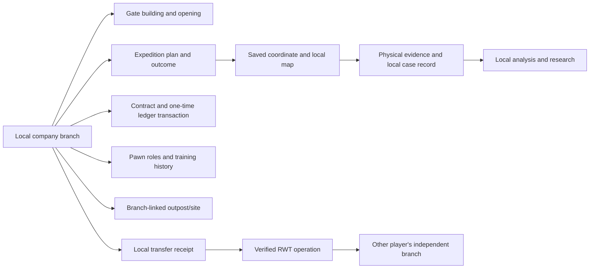

# Rimrooms - Async Industries: campaign state and save ownership

**Status:** pre-code ownership contract. The candidate RimWorld component classes in [TECHNICAL_ARCHITECTURE.md](TECHNICAL_ARCHITECTURE.md) still require API verification. This file names the information the campaign needs, which save/map/object owns it, and the rules required to keep it stable across saves and co-op transfers.

## Ownership rule

Each player's facility, branch ledger, research completion, contracts, discovered coordinates, expedition plans, case records, and local Backrooms maps stay in that player's save. RimWorld pawns, buildings, items, maps, and world objects keep their normal game ownership. A transfer creates a receipt and a recipient-side copy only after RWT has demonstrably delivered it; it does not merge the two branches.

| Record | What it remembers | Authoritative owner | Important links and safeguards |
| --- | --- | --- | --- |
| Scenario start | Scenario ID/version, initial objective, starting grant key, selected branch and seed | Local branch/new-game record | Apply once. Reloading must not grant pawns, stock, funds, or quests a second time. |
| Company branch | Branch ID, account totals, research completion, hires/roles, open contracts, company reputation, and local progression | One local campaign record | Branch ID is stable for the save. Every company action writes here or to a named local object, never to a global shared singleton. |
| Facility | Map/site identity, room plans, access policies, incoming orders, security status | Normal RimWorld map/buildings plus linked branch records | Physical stock, pawn jobs, power networks, and room changes remain on the map. UI summaries are read-through views. |
| Staff assignment | Pawn ID, company role, training/certification history, expedition history | Pawn for health/skills/needs/equipment; branch for company assignment history | Do not use pawn name or list position as an identity key. Missing/dead pawns leave a readable history, not a dangling active assignment. |
| Gate | Building reference, condition, modules, calibration, current state, operator, active opening ID | Gate building for local condition/state; branch expedition for plan and outcome | Only one owner decides whether the gate is open. Keep current activity linked by stable ID, not a duplicate timer in the UI. |
| Expedition | Expedition ID, crew IDs, coordinate, opening/closing game ticks, equipment manifest, recall decision, outcomes | Local branch | Each launch has one ID. State moves through planned → dispatched → on-site → returning/aborted → closed or documented failure. Never reconstruct the outcome from a screen. |
| Coordinate discovery | Branch-local coordinate ID, seed inputs, generator version, known routes, markers, discovered facts | Local branch discovery record | Discoveries are private to the branch unless a later supported transfer creates an explicit copy. A coordinate ID is not a claim that another player's map is shared. |
| Destination/site | Seed, generator version, initial room graph, persistent local changes, site history | Normal world/site object and its saved map | Reopening restores the visited site. New generation requires a new coordinate identity. An explicit migration may change selected documented features; it cannot silently reroll the map. |
| Evidence item and case | Physical item/person reference, evidence ID, acquisition event, source coordinate, custody history, analysis, case status | Item/pawn holds physical custody; branch record holds case and analysis history | Every record points to an acquisition event and coordinate. Destruction, sale, examination, or transfer writes a disposition before custody changes. |
| Research project | Project ID, prerequisites, evidence links, progress, completion, unlock IDs | Local branch and normal bench/pawn work | Completion is branch-local. A physical dossier is an item that can provide a local study; it does not write completion into another save. |
| Contract and transaction | Contract ID, accepted objectives, due game tick, deliverables, result, credit amount, transaction ID | Local branch | Post payment/penalty once. Tie every outcome to delivery, evidence, or a recorded failure; no hidden duplicate payouts. |
| Shipment | Order ID, sender/receiver branch IDs when applicable, item/pawn manifest, dispatch/delivery state | Sender branch until RWT delivery; then receiver branch owns its local receipt and arrived objects | Each receipt ID is idempotent. Failed or unsupported cargo remains visible and recoverable; never delete it or credit it twice. |
| Outpost | Site ID, local map/stock, assigned crew, supply/relay status, upkeep, evacuation/abandonment history | Local site plus branch's network record | Missing contact creates a stale-status warning, not a fabricated stock total. Abandonment previews lost, recovered, and remaining goods. |
| RWT transfer/activity receipt | RWT route, sender/receiver branch IDs, item manifest, receipt/status, retry/recovery information | RWT for its world operation; local receipt in each participating branch | Do not invent a custom shared schema. Store only identifiers and results available through a verified supported path. |
| Optional integration link | DLC/mod package IDs, relevant external world object, local contract/case reference | External mod owns its object; Rimrooms branch owns its own connection record | Losing an optional mod must not erase the Core campaign. Missing links display as unavailable and keep recovery data. |

## Stable identifiers and time

Use explicit stable IDs for scenario definition/version, branch, coordinate, site, expedition, crew assignment, evidence, case, research project, contract, company transaction, shipment, and transfer receipt. IDs must not depend on display names, list order, or UI selection order. Store the seed inputs and generator version beside a generated destination. Record durations/deadlines in RimWorld game ticks, not the player's local wall clock.

Starting grants, mission launches, objective completions, contract rewards, and received shipments each need a unique operation/receipt key. Replaying a saved event with the same key returns its recorded outcome rather than creating a duplicate. Physical item stacks remain the source of truth for what is actually carried, stored, consumed, sold, or transferred.

## Save versioning and recovery

- Give the campaign data, scenario start, coordinate generator, and any transfer receipt their own explicit version fields.
- Keep saved fields stable. Before a rename/removal, add a migration that preserves branch, staff, sites, maps, evidence, contracts, and account totals.
- Preserve old visited coordinates when generator rules change. If a map cannot be migrated safely, keep its saved data and offer a clear recovery route; do not regenerate it under the old ID.
- If a referenced pawn, building, item, map, DLC, or optional mod is absent, mark the link missing and retain the readable case/transaction history.
- Save failures and RWT disconnects must not leave an item removed from the sender without a receiver-side receipt or recovery record.

## Ownership flow

## Verification work still required

This dictionary is a design contract, not save-code evidence. After Gate 0, validate round-trip saves for a fresh scenario, active gate, in-progress expedition, changed destination, case-linked item, open contract, ledger payment, outpost shipment, and a disconnected/reconnected RWT transfer. Record migrations from each released schema version. See the [first playable acceptance contract](FIRST_PLAYABLE_CONTRACT.md) and [RWT baseline plan](research/RWT_BASELINE_TEST_PLAN.md).
