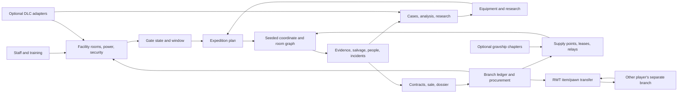

# Rimrooms - Async Industries: pre-production and complete implementation backlog

**Purpose:** this is the master checklist from the current design folder to a releasable, polished RimWorld 1.6 mod. It includes work before code starts, the file/package work, every interconnected game system, all 294 local profile entries, RimWorld Together, all five DLCs, the two selected gravship chapters, verification, and release maintenance.

**Current state:** design and research files exist; there is no mod source project, C# assembly, XML Def package, art/audio package, or in-game implementation. The 294 rows are the full-profile research/test target, but only Core and the RWT/Harmony multiplayer stack are required; other profile mods are optional. The [Gate 0 decision sheet](GATE_0_DECISIONS.md) records the owner's selections. The public author/publisher remains intentionally unset; the displayed title is exactly **Rimrooms - Async Industries**. The [feature traceability map](FEATURE_TRACEABILITY.md) ties gameplay systems to design, lore, mod-profile rows, presentation, implementation surfaces, and acceptance evidence. Most mod, source, and runtime research is still pending. Start from the [source register](SOURCE_REGISTER.md), then use the [design plan](MOD_INTEGRATION_PLAN.md), [technical architecture](TECHNICAL_ARCHITECTURE.md), [game brief](GAME_DESIGN.md), [scenario contract](SCENARIOS.md), [research index](RESEARCH.md), [294-row register](../outputs/rimrooms-async-industries-register-2026-09-27/Rimrooms_Async_Industries_294_Mod_Integration_Register.xlsx), and [direct-linked video index](research/kane-pixels-video-index.csv).

## How to use this backlog

- Check an item only when its evidence or deliverable is saved in the project folder and reviewed.
- `BLOCKER` means the work must be done before that implementation phase begins. `GATE` items must pass before moving to the next phase.
- `DECISION` means owner direction is missing or needs to be made durable in the [Gate 0 decision sheet](GATE_0_DECISIONS.md). The current D1–D9 selections there are recorded owner decisions.
- Every code task needs a save/load path, a UI route, error handling, a dependency rule, and acceptance criteria. Avoid disconnected content that cannot be reached or used in the campaign.
- The 294 profile is a target integration list. A mod can be “integrated” by using its native feature, supporting it without patches, adding a narrow adapter, or documenting a verified conflict. Do not write needless patches just to claim a mod was touched.

## Locked direction from the owner

- [x] Target RimWorld 1.6; Royalty, Ideology, Biotech, Anomaly, and Odyssey are optional integrations. Keep the campaign playable on Core.
- [x] Start with a small corporate research/security facility, not the ordinary crashlanded start.
- [x] Provide distinct selectable campaign starts: Async Industries facility, Furniture & Knickknack Store breach, and Lone Survivor inside a seeded coordinate; build the facility opening first and preserve a shared scenario/generation contract.
- [x] Make the gate, expeditions, company management, money, hiring/training, security, procedural spaces, research, mysteries, entities, outposts, and expansion the central loop.
- [x] Use the 294-entry local server profile as the full research and test target, but require only RimWorld Core plus Harmony/RWT for multiplayer. Every other profile mod remains optional; the full profile is not yet compatibility-certified.
- [x] Official mod title: **Rimrooms - Async Industries**.
- [x] Use RimWorld Together for asynchronous cooperation: separate facilities, resources/item exchange, research dossiers, and (if supported and safely tested) shared research ledger and visits; no live shared-map control.
- [x] Include Vanilla Gravship Expanded Chapters 1 and 2 as optional late-game integrations.
- [x] Use Kane Pixels' series as the primary Backrooms story/lore source and review the A24 feature separately. Adapt the canon, lore, themes, and style indirectly rather than recreating specific scenes or characters; track the reviewed source for all adaptations.
- [x] First distribution target: private RimWorld Together prototype; consider public Steam Workshop release only after named-profile and multiplayer validation.
- [x] Displayed title stays exactly **Rimrooms - Async Industries**. Author/publisher metadata is `Operator`; MIT does not supply or alter that value. Package ID: `UnityLabAI.RimroomsAsyncIndustries`; internal C# namespace: `RimroomsAsyncIndustries`; semantic versions (`0.x` pre-release, `1.0.0` stable).
- [x] English-first, localization-ready; keep a Core-only solo path and use RWT for co-op. Original source code is MIT; art/audio licenses are tracked separately.
- [x] Audience: mature psychological horror/management, with the strongest horror presentation the game and tested profile can support.

## Owner decisions that still affect the build

The recorded decisions are in [GATE_0_DECISIONS.md](GATE_0_DECISIONS.md). They are fixed for pre-production and implementation. The chosen code license does not cover third-party assets; record those separately.

## Phase 0 — pre-code blockers and research

### 0.1 Project ownership and product contract

- [x] Record D1–D9 in [GATE_0_DECISIONS.md](GATE_0_DECISIONS.md) and propagate the selected product, dependency, DLC, source, multiplayer, language, license, identity, and content-direction choices.
- [x] Define the “AAA-grade” acceptance bar in measurable terms: see [pre-production acceptance standard](research/PREPRODUCTION_ACCEPTANCE_STANDARD.md). Its performance ceilings still need a named test machine and baseline before implementation.
- [x] Create a provenance register for source-specific names, text, character designs, visuals, sound, and equipment at [provenance-register.csv](research/provenance-register.csv). Preserve the owner's rights premise as an owner-provided statement; complete per-asset source/license entries before distribution and keep other mod publishers' files out of the project.
- [x] Define the optional-mod support and maintenance policy for the 294 optional profile mods in [OPTIONAL_MOD_SUPPORT_POLICY.md](research/OPTIONAL_MOD_SUPPORT_POLICY.md).
- [x] Record the mature-horror content direction, platform-questionnaire requirement, and accessibility baseline in [CONTENT_ACCESSIBILITY_BRIEF.md](research/CONTENT_ACCESSIBILITY_BRIEF.md). No formal age rating has been assigned.

### 0.2 Official-source review

- [x] Verify the official Kane Pixels playlist and establish a continuity/story review map for the 23 uploads; keep playlist order separate from in-world chronology: [Kane Pixels lore/story map](research/KANE_PIXELS_LORE_STORY_MAP.md).
- [x] Compile short story notes for all 23 entries in [the official Kane Pixels video index](research/kane-pixels-video-index.csv), using linked fan episode summaries. Capture the story beats, memorable spaces or threats, open mysteries, and one possible RimWorld hook; label this secondary coverage clearly in [Kane Pixels fan cliff notes](research/KANE_PIXELS_FAN_CLIFF_NOTES.md).
- [x] Write a separate, high-level A24 film note from the fan-maintained plot summary, covering its story, people, memorable spaces, and original scenario or quest ideas. The note is a secondary synopsis, not a direct review: [feature story note](research/reviews/a24-feature/feature-review.md).
- [x] Record the fan-guide supplemental-scope decision without changing the official 23-entry index: keep `Faultline.mov` as a separate companion lead with causality unresolved; exclude `Simpsons` from shipped scope because the fan guide attributes it to Laura Harris rather than Kane's official channel. Revisit creator-source details only if a planned feature needs them: [supplemental notes](research/KANE_PIXELS_FAN_CLIFF_NOTES.md#fan-identified-hidden-clips-outside-the-23-entry-playlist).
- [ ] Recheck official source/playlist contents when content production starts; the video count and available captions can change.
- [ ] Mark each candidate game element as an indirect Kane/A24 adaptation or original design. Broader community canon is not part of shipped content. Track each feature's source record.
- [x] Establish first-pass story coverage before source-specific content begins: 23 concise series fan summaries plus a separate feature fan-summary note, with source links and uncertainties labeled. Continue to resolve only source-critical questions in [FEATURE_TRACEABILITY.md](FEATURE_TRACEABILITY.md).
- [x] Read the official RimWorld 1.6 Modder Primer and current public mod-folder/load-folder guidance, then compare the package rules to the installed 1.6 data and the selected profile's exact manifests. Findings and remaining API questions are in [RimWorld 1.6 package and generation findings](research/RIMWORLD_1_6_PACKAGE_AND_GENERATION.md).

### 0.3 Individual review of the 294-mod profile

- [x] Preserve source load-order row, display name, package/Workshop ID, and config type in the CSV/workbook.
- [x] Give all 294 rows a preliminary system family, intended Backrooms use, dependency stance, and compatibility watch.
- [x] Record individual source facts for 291 selected profile rows, including RimWorld Together, both gravship chapters, and high-priority facility, power, trade, quest, staff, custody, security/research, medical, storage, and defense mods; each note separates publisher/source claims from design use and what still needs a runtime check.
- [ ] Continue the full per-row review in bounded batches under the [294-mod agent roadmap](research/MOD_REVIEW_AGENT_ROADMAP.md); the source register, CSV, workbook, interaction clusters, and counts must stay synchronized.
- [x] Parse the exact 294 local `About.xml` records and declared load/dependency relationships; capture version declarations and absent `LoadFolders.xml` targets for follow-up. This is an installed-metadata snapshot only. See the [dated findings note](research/RIMWORLD_1_6_PACKAGE_AND_GENERATION.md), [metadata CSV](research/installed-mod-metadata-2026-09-27.csv), and [relationship CSV](research/installed-mod-relationships-2026-09-27.csv).
- [x] Compare the current local client `ModsConfig.xml` against server `ModConfig.json`: 294/294 IDs map, with zero missing/extra records and zero load-order differences on 2026-09-27. See [RWT and gravship audit](research/RWT_AND_GRAVSHIP_FEASIBILITY.md). This is a snapshot match, not a compatibility test.
- [ ] For every row, inspect the exact Workshop page and current 1.6 version, `About.xml`, required DLC/mods, license/asset notes relevant to interoperability, feature list, and known incompatible mods.
- [ ] Inspect source/XML/API for mods with direct game-state overlap: RimWorld Together, both gravship chapters, all frameworks, world/site/quest mods, portals, power systems, research UI, prisoner/capture mods, storage/cargo, map/terrain generation, and pawn/work/job systems.
- [ ] Complete the source review in bounded agent batches using the [294-mod review roadmap](research/MOD_REVIEW_AGENT_ROADMAP.md); the lead agent validates findings and owns review-file, CSV/workbook, interaction-list, and count updates. Do not mark source review as runtime compatibility.
- [ ] Resolve the co-op scope for profile row 182, Questionable Ethics Enhanced. Its publisher says RimWorld multiplayer will not work properly; keep it optional and do not claim RWT support while the owner decision and exact-profile evidence are pending. See the [Gate 0 question](GATE_0_DECISIONS.md#open-owner-choice-surfaced-by-mod-review).
- [ ] Resolve the co-op scope for profile row 274, Medical Dissection. Its publisher warns multiplayer is unsupported and may desynchronize; keep it optional and outside any RWT support claim until the owner chooses scope and testing justifies a change. See the [Gate 0 question](GATE_0_DECISIONS.md#open-owner-choice-surfaced-by-mod-review).
- [ ] Turn each row into one final action: **use native feature**, **configuration-only**, **narrow adapter**, **compatibility patch**, **avoid touching; verified alongside**, or **known conflict/not supported**. Add evidence and tested version. No row may remain “assumed from title” at release.
- [ ] Complete the dependency/conflict/feature graph from the exact package IDs and load order. An initial local-declaration graph exists in the [metadata snapshot](research/installed-mod-relationships-2026-09-27.csv); it still needs Workshop/source confirmation, feature interactions, inactive/optional targets, patch checks, and reproduced conflicts.
- [ ] Establish an interaction map for the full 294: which Backrooms systems call each mod, which ones should remain untouched, and which pairs need a reproduced test. Preserve QoL mods' functions and key bindings.
- [ ] Review mods by family first, then inspect high-risk members individually. Don't assume a family-level pass certifies its individual members.
- [ ] Update the register's status for every row as reviewed/version-pinned/tested or pending; the final workbook must agree with the exact local client/server list.
- [x] Add and maintain the `FeatureTraceIDs`, `ReviewRecord`, `ReviewStatus`, `FinalDisposition`, `EvidenceBuild`, and `AcceptanceEvidence` columns specified in [FEATURE_TRACEABILITY.md](FEATURE_TRACEABILITY.md) in the authoritative workbook and CSV. The register now has 291 accepted individual source-fact notes and 3 pending reviews; rows 96, 237, and 278 have partial notes awaiting direct source review, and combined-profile runtime compatibility remains untested. See the [294-row register](../outputs/rimrooms-async-industries-register-2026-09-27/Rimrooms_Async_Industries_294_Mod_Integration_Register.xlsx) and [inventory CSV](research/rimworld-server-mod-inventory.csv).
- [ ] Replace those placeholders for all 294 rows with verified feature IDs, exact review record paths, evidence-backed dispositions/builds, and tested acceptance evidence before code starts. “Pending mapping” and “Pending review” are not final outcomes.

### 0.4 RimWorld Together and gravship feasibility

- [x] Capture the local server executable product hash, client active package IDs, and ordered 294-entry list; map client package IDs through installed Workshop metadata and compare them with the server list. Results are recorded in [RWT_AND_GRAVSHIP_FEASIBILITY.md](research/RWT_AND_GRAVSHIP_FEASIBILITY.md).
- [x] Compare server `ModConfig.json` with the actual client `ModsConfig.xml`. They match exactly today; `AllowAllMods=true`, `EnforceSettings=false`, and null `ModOrder` mean the server does not enforce that match.
- [x] Review current official [RWT release notes](https://github.com/RimWorld-Together/Rimworld-Together/releases), the [Workshop page](https://steamcommunity.com/sharedfiles/filedetails/?id=3005289691), and official wiki guidance for offline activities. Record the likely fit and runtime uncertainties in the [RWT mod review](research/reviews/mods/3005289691-nova.rimworldtogether.md).
- [x] Pin the local RWT Windows server archive to published release 26.8.31.1 by matching its SHA-256 to the official release asset. Record the executable's embedded product-version commit separately; it is not the release tag commit.
- [x] Pin the local pre-build test target: RimWorld 1.6.4871 rev590, installed five-DLC profile, Harmony metadata/assembly, RWT server release artifact, RWT client DLL, and exact 294-entry client/server profile hashes. This identifies the reproducible local target; it does not claim the RWT client/server pair or Rimrooms behavior has passed runtime testing.
- [ ] In a disposable two-player world, verify separate company starts, an offline visit, ordinary supply exchange/aid, and reconnect without losing or duplicating pawns or goods. Do not claim a Rimrooms custom-dossier transfer until that item exists and is tested.
- [ ] Choose only the RWT options needed for those activities and write down the simple server/join setup and recovery steps. Check whether players can use different starts on one server; if not, say so plainly in co-op setup guidance.
- [x] Pin the actual RWT Windows server release before coding. The local archive matches the official `26.8.31.1` release asset digest. The client DLL is separately pinned by file hash and embedded product version; compatibility behavior and any custom API remain unverified.
- [x] Record the current Workshop feature/dependency/license statements and installed 1.6 metadata for [Gravship Expanded Chapter 1](https://steamcommunity.com/sharedfiles/filedetails/?id=3609835606) and [Chapter 2](https://steamcommunity.com/sharedfiles/filedetails/?id=3799737423); create one linked source review per chapter. Their likely conflict boundary and unfinished runtime evidence are explicit.
- [ ] Inspect supported extension points/source APIs, map every active profile mod that changes gravships, and verify the clean VGE-only chain before testing the full 294-mod profile. See the [gravship feasibility audit](research/RWT_AND_GRAVSHIP_FEASIBILITY.md).
- [ ] Configure the supported RWT co-op profile to require Core, Harmony, RWT, and the Rimrooms package; list other 294-profile mods as optional, while recording tested versions/order and join guidance.
- [ ] Confirm the co-op experience on the exact pinned RWT build. Keep research, maps, gate state, and company finances owned by each branch; treat a research dossier as a tradeable story item only after custom-item transfer succeeds.

### 0.5 Pre-code design freeze

- [ ] Freeze the player loop and first playable milestone: facility → staffing → gate assembly/power/calibration → timed expedition → extraction → analysis → payment/research.
- [x] Create the canonical [scenario contract](SCENARIOS.md): shared state fields, Async Industries/Store/Lone Survivor openings, future candidate starts, multiplayer caveat, and acceptance checklist.
- [ ] Complete concrete map/pawn/faction/inventory/gate/coordinate values, objective branches, failure/recovery flow, tutorial text, and convergence events for each of the three planned openings. Keep Async Industries as the first playable; implement the store and survivor starts after the vertical slice.
- [ ] Verify whether different RWT branches can use different start scenarios on the same server/world. If not supported, specify a shared scenario requirement for co-op sessions.
- [ ] Freeze separate branch ownership: local company ledgers/maps remain authoritative; trade resource/item dossiers; implement direct shared research only through a supported RWT extension and successful synchronization tests; facility visits use only verified RWT activities.
- [ ] Freeze a complete content inventory: staff roles, rooms, machines, field gear, furniture/salvage, research branches/tiers, evidence types, entities, anomalies, contracts, incidents, room archetypes, outposts, space content, translations, and accessibility needs.
- [ ] Define the campaign math: prices, wages, food/sleep/rest needs, research costs, gate draw, open-window growth, crew/cargo limits, losses, recovery, rent, reputation, contract bonuses/penalties, and outpost upkeep. Use spreadsheets for balance hypotheses and preserve versioned formulas.
- [ ] Define entity/anomaly rules and counterplay for each proposed threat before coding its Defs: tells, trigger, limits, behavior, evidence, response, containment, possible outcomes, and accessibility cues.
- [ ] Define room-template tags, coordinate identity, procedural seed inputs, graph/path validation, bounded propagation rules, fog-of-war, return clues, map revisits, and generator migration behavior.
- [ ] Define all Operation panes and each action's preconditions/result/error state; mark which action is local state and which crosses the RWT boundary.
- [ ] Finish the data model and save ownership diagram in `TECHNICAL_ARCHITECTURE.md`; identify stable IDs and migration needs before defining save keys.
- [x] Resolve the owner decisions and approve the dependency/source-transfer direction. Research, RWT feasibility, save ownership details, and the full profile mapping remain Gate 0 blockers.
- [ ] Complete [FEATURE_TRACEABILITY.md](FEATURE_TRACEABILITY.md) for every planned feature, all linked research/source paths, all 294 row assignments, planned files, presentation rules, DLC/RWT boundaries, state ownership, and acceptance proof.
- [ ] Freeze the original visual/UI/audio guide for facility, gate, Backrooms room families, furniture/salvage, staff/equipment, entities, evidence, Operations, and all scenarios; link each style rule to its inspiration/review record or label it original.

### Coding-start gate

**Gate 0 passes only when:** D1–D9 are recorded and propagated; RimWorld/DLC/Harmony/RWT client/server targets are pinned; all 23 series entries and the separate A24 feature have short story notes based on fan guides or official material, with uncertainties labeled and source-critical gaps checked as needed; the exact 294 profile has per-row source/version/dependency/license/interactions review, feature IDs, final disposition, and a completed dependency/conflict/feature graph; RWT dossier/ledger sync, visits, scenario, save, reconnect, and trade behavior required by the chosen contract is verified in a disposable profile; the full feature/source/mod/style/file traceability map is complete; scenario, campaign math, threats, procedural generation, interface, save ownership and migrations, provenance, architecture, build strategy, and acceptance plan are frozen; and all baseline test cases are written. **Do not create the Rimrooms code project, XML Defs, or production source-specific content before Gate 0 passes.** This strict pre-build boundary follows the owner's request that preparation and all needed research be completed before building begins.

## Phase 1 — repository, build, and content foundations

- [ ] Create a Git repository with `main` plus feature branches, ignore generated assemblies/logs/local references, and add a contribution guide/code style.
- [ ] Capture installed RimWorld managed assemblies and required reference DLL versions locally; never commit proprietary game or DLC assemblies.
- [ ] Create a reproducible C# solution/project targeting the RimWorld 1.6 runtime/compiler constraints; record reference paths, build configurations, output path, and warning policy.
- [ ] Add a local dev launch configuration for a clean Core-only profile and a pinned RWT/profile launch configuration.
- [ ] Create build/package scripts that copy only distributable files and produce a versioned mod folder/archive; ensure local DLL references, logs, source notes, and third-party assets are excluded.
- [ ] Create the mod identity files: `About/About.xml`, `About/Preview.png`, package IDs, supported versions, dependencies, description, and load folders. Use the selected title/package ID/version policy and set author/publisher to `Operator`.
- [ ] Add README install/configuration/dependency guidance, changelog, credits, source/asset provenance ledger, version policy, bug report template, and save-migration policy.
- [ ] Add `Languages/English/Keyed/` before UI strings are introduced; avoid visible hard-coded strings in C#.
- [ ] Define namespaces/Def naming conventions, texture/audio conventions, stable IDs, XML validation rules, and file ownership boundaries.
- [ ] Create a placeholder-free art/audio brief with resolutions, UI icon grid, palette, readability, animation, sound levels, and accessibility requirements.

### Planned mod package layout

```text
About/                         About.xml, Preview.png, metadata
Assemblies/                    Built RimroomsAsyncIndustries.dll only
Defs/
  Scenario/                    Candidate scenario defs/setup hooks; confirm exact 1.6 loader convention first
  Buildings/                   Gate, consoles, labs, utility/security objects
  Items/                       Equipment, samples, dossiers, salvage, cargo
  Pawns/                       Staff/entity defs and factions where needed
  Work/                        Work types, jobs, bills, recipes
  Research/                    Backrooms project trees and unlocks
  Quests/Incidents/World/       Contracts, distortions, sites, outposts
  Rooms/                       Template tags and generator content
Languages/English/Keyed/       All player-visible labels and messages
LoadFolders.xml                Core and conditional DLC folders
Patches/                        Narrow, package-guarded compatibility patches
Source/RimroomsAsyncIndustries.sln  C# solution
  Core/ Company/ Scenarios/ Gate/ Expedition/ Generation/ Research/ Cases/ Economy/
  UI/ Save/ Compatibility/RimWorldTogether/ Compatibility/DLC/
Textures/                       Original icons, buildings, entities, effects
Sounds/                         Original ambience and effects
Tests/QA/                       Deterministic generation, save fixtures, checklists
Docs/                            Design, integration, provenance, release notes
```

Final names and folder conventions must be confirmed against RimWorld 1.6's actual loader and local build; this proposed tree is not an implemented package.

## Phase 2 — code architecture and safe vertical slice

### Core contracts

- [ ] Implement a core campaign state owner for local branch identity, company ledger, project IDs, contracts, coordinate IDs, case IDs, and schema version.
- [ ] Implement a versioned, data-driven scenario definition/initializer that applies one start exactly once, records its stable scenario ID, and routes generated starts through the shared coordinate/evidence/expedition services.
- [ ] Implement one authoritative gate state machine with validated transitions, actions, preconditions, costs, warnings, timers, and event log.
- [ ] Implement a single transaction service for stock/currency/job/project changes; prevent duplicate delivery/reward and never silently discard unsupported transferred items.
- [ ] Implement stable site/coordinate IDs, deterministic seed construction, generator version, room graph records, map ownership, revisit behavior, and bounded cleanup policy.
- [ ] Implement stable references to pawns/buildings/sites via game-supported serialization; avoid stale references and duplicated pawn inventories.
- [ ] Add structured log categories and debug summaries for campaign/coordinate/gate/contract/case/RWT operations. Include seed and failing stage for generated-site errors.
- [ ] Add versioned save components and migration from each released schema before saving or loading content updates.
- [ ] Keep UI view models separate from simulation state so the Company Command layout can change without data migrations.

### Vertical slice implementation

- [ ] Create the Async Industries new-game scenario with starter facility, staff, stock, limited funds, disabled gate, first project, and tutorial, following `SCENARIOS.md`.
- [ ] Add gate frame, control console, power requirements, emergency cutoff, assembly/calibration work, operation feedback, failure states, and repair costs.
- [ ] Add staff role recommendations, field kit assignment, readiness checks, and basic company tasks while retaining vanilla pawn/work controls.
- [ ] Create one seeded, finite Backrooms site with a short room graph, one hazard, one learnable entity, one evidence chain, one exit/recall path, and one reward.
- [ ] Add expedition dispatch/recall/close flow; track crew/cargo/location/return and handle death, injury, missing, late return, and aborted runs.
- [ ] Add evidence intake, one lab analysis recipe/project, one researched capability, a payment/contract result, and a traceable company ledger entry.
- [ ] Save, reload, revisit the same coordinate, and confirm map state and unique rewards persist without duplication.
- [ ] Provide a safe fallback map and recoverable error message when generation cannot produce a valid route.

**Gate 2 passes when:** the first complete loop plays from a fresh save through build, staff, expedition, extraction, analysis, reward, save/reload, and a second visit without a softlock or lost state.

## Phase 3 — interconnected company simulation

### Scenario framework and alternate starts

- [ ] Keep the first acceptance target on Async Industries while making its scenario setup consume the same versioned start contract intended for alternate starts.
- [ ] Implement Furniture & Knickknack Store after Gate 2: validate public-area security, store stock/ownership, basement threshold, missing-person objective, and return/contract convergence.
- [ ] Implement Lone Survivor after Gate 2: validate a seeded inside start, one-pawn survival, finite field kit, learned-rule/evidence persistence, return/rescue/outpost alternatives, and no facility prerequisite.
- [ ] Add outpost, town-distortion, or company-in-crisis starts only after a design brief defines their starting state, pressure, failure/recovery, and acceptance evidence.
- [ ] Verify every start's reload behavior, deterministic coordinate, objective idempotency, optional-DLC fallback, solo behavior, and RWT eligibility against `SCENARIOS.md`.

### Facility and personnel

- [ ] Implement physical room functions: gate, control, labs, evidence archive, quarantine/decontamination, medical, armory, workshop, power, radio, receiving, storage, cafeteria, recreation, quarters, and outpost.
- [ ] Connect each room to concrete capabilities, stock needs, staff jobs, risks, and UI alerts; expose why a room is not functional.
- [ ] Add applicant/talent pools for candidates, specialists, contractors, survivors, returning staff, and referrals, with inspectable skills, health, traits, salary/term, and recruit action.
- [ ] Add configurable company roles, staff schedules, certifications, training jobs, field history, trust/stress/exposure and equipment familiarity; preserve pawn autonomy and vanilla skill/trait systems.
- [ ] Add cafeteria, sleep, recreation, injury recovery, shift rotation, staff needs, conflict/wellbeing alerts, and accommodation capacity.
- [ ] Integrate existing hospitality, guest, prisoner, medical, and QoL systems only through evidence-backed adapters; keep native interactions available.

### Gate, equipment, and expedition operations

- [ ] Add machine subsystems/upgrades: power reserves, calibration, stabilizers, monitoring, emergency cutoff, cool-down, modules, repair, and reliability.
- [ ] Add field equipment: protective gear, weapons, restraints, med kits, recorder/camera, radio/repeater, mapping gear, detector/scanner, beacon/tether, sample kit, cargo frame, portable power, and tools.
- [ ] Give every piece of gear a visible effect on detection, safety, information, cargo, route finding, or return reliability.
- [ ] Add crew composition and cargo planner with skill/health/weight/gate-window checks, ready/unready reasons, and cost preview.
- [ ] Add gate-window progression minutes → hours → days → weeks/months with power, heat, maintenance, supplies, crew rotation, communication, and increasing complexity costs.
- [ ] Add schedule, warning, recall, evacuation, emergency close, lost-connection, failed return, and rescue workflows.
- [ ] Add fog-of-war atlas, route notes, last-known position, evidence chain, return beacon, route clues, saved room graph, and revisit changes.

### Procedural sites and propagation

- [ ] Implement a tagged room/corridor library and deterministic topology generation by coordinate, mission, equipment, research, company tier, and saved history.
- [ ] Validate map size, accessible entrances/exits, walkable paths, mission objects, safe return clues, playable combat spaces, and generation budget.
- [ ] Add room families, furnishing rules, lighting/material palettes, loot, salvage, hazards, clue placement, threat events, and theme variations.
- [ ] Implement bounded non-Euclidean effects: repeats, moved door/exit, impossible adjacency across site links, altered room dimensions, topology loops, changed object/room identity, and controlled map transitions.
- [ ] Add saved, rule-based anomaly propagation across room graphs with observable clues, equipment detection, player countermeasures, cap/decay, event log, and deterministic save/reload.
- [ ] Make equipment meaningfully change what is detected or generated without breaking seed reproducibility or invalidating an already saved coordinate.
- [ ] Add map state versioning, archival, generator upgrades, explicit migration tests, and recovery if an old site cannot load.
- [ ] Bound active map count, pawn/thing count, graph search, event evaluation, and background tick cost; profile large, long-running saves.

### Economy, contracts, and evidence

- [ ] Implement branch-local financial ledger with auditable credits/debits, payroll, upkeep, purchases, shipments, contract advances, salvage, penalties, compensation, and profit report.
- [ ] Implement equipment/material procurement, source/price/deadline, shipment manifest, receiving area, delay/loss/damage events, cancellation, and delivery receipt.
- [ ] Implement contract/quest templates for surveys, retrieval, furniture/salvage, samples, transcripts, rescue, containment, security, lease/site construction, town distortion, outpost delivery, and gravship support.
- [ ] Generate bounded story variations from client/faction, coordinate, staffing, discovered rules, company tier, previous outcomes, opening duration, and available equipment.
- [ ] Add space leasing/claiming with cost, boundaries, term, access/security requirements, maintenance, renewal, eviction, and exit/abandonment consequences.
- [ ] Implement evidence provenance/custody/type/value/risk/confidence, sample storage, research value, sale value, client deliverable, archive, chain of custody, and destruction choice.
- [ ] Add analyze/interview/compare/review workflows for equipment, furniture, people, entity remains, recordings, transcripts, route notes, and recovered documents.
- [ ] Add repeated missing-person mysteries with radio fragments, missing crews, delayed return, witness conflict, reappearance/death, rescue, and case closure.
- [ ] Make sale/study/use/contain/release/recruit/detain/transfer choices visible with financial, staff, faction, legal-in-world, trust, and security consequences.

### Research, entity, and expansion progression

- [ ] Define research IDs, tier gates, evidence prerequisites, benches, labor/cost, alternative discovery routes, unlocks, dossier output, and fallback when optional research mods/DLC are absent.
- [ ] Complete research branches for facility/power, engineering, field safety, equipment, mapping, communication, stability, containment, medicine, logistics, commerce, orbital operations, and deep topology.
- [ ] Author entity/anomaly design sheets first: appearance/readability, AI rules, triggers, limits, interaction, tells, counters, evidence, study risk, capture/storage, sale value, and fail states.
- [ ] Implement containment rooms, security procedures, prisoner/witness interviews, staff debrief, quarantine, alarm/escape response, evidence custody, and case records.
- [ ] Implement anomaly openings at ordinary RimWorld settlements as timed quests with perimeter, rescue, evidence, witness, close/stabilize, and follow-up objectives.
- [ ] Add outside-gate and inside-site radio stations, supply points, relief teams, depots, guarded space rental, research/shelter outposts, servicing, loss/evacuation, and return routes.
- [ ] Add vehicles and space travel as logistics branches; maintain the gate as the defining Backrooms access mechanism.
- [ ] Add VGE Chapter 1 logistics summary/operations links without replacing its oxygen/fuel/power/heat/crew systems.
- [ ] Add VGE Chapter 2 orbital security/contracts/wreck salvage hooks without patching its gravship internals or mixing orbital enemies into Backrooms entity generation.

## Phase 4 — multiplayer, DLC, and the full profile

### RimWorld Together adapter

- [ ] Implement feature detection and setup diagnostics for the pinned RWT release; support unavailable/admin-disabled feature states.
- [ ] Implement no custom server schema or patches until supported extension points are identified from the exact code version.
- [ ] Verify guild identity, facility mapping, configured visits/snapshot behavior, visits when online/offline, transfer spot, chill/defense spots, caravan interactions, events, sites, roads, aid, gifts, and trading.
- [ ] Verify transfer receipt IDs and item/pawn state prevent duplicates, loss, stale ownership, and broken stacks on disconnect/reconnect.
- [ ] Verify Backrooms Research Dossier item transfer; receiving branch must explicitly study it locally and be unable to claim it twice in one save.
- [ ] Test unsupported/complex modded items and define an honest fallback message rather than promising an unverified transfer.
- [ ] Test separate colony saves, shared world actions, mod order/config enforcement, RWT server restart/backups, and an admin changing settings during play.
- [ ] Document exact server setup and player experience. No statement may describe live shared-colony control or synchronized research unless implemented and demonstrated.

### Five DLC layers

- [ ] Base Core-only campaign works and loads with every DLC absent.
- [ ] Royalty conditional content: titles/quests/faction/psycasts only as optional company routes.
- [ ] Ideology conditional content: beliefs, meditation, rituals, staff policies, and recreation only when available.
- [ ] Biotech conditional content: genes, mechanitors, children, medicine, pollution, and mechanoid options; no mandatory gene/resource dependency.
- [ ] Anomaly conditional content: containment/research links; Backrooms entities retain a base-game implementation.
- [ ] Odyssey conditional content: gravship/off-world logistics and any compatible space travel.
- [ ] Verify all five individually enabled/disabled, then all combined. Maintain a 32-row DLC bitmask matrix (all combinations of five DLCs) if claiming full combinatorial support; at minimum, explicitly publish exactly which combinations were run.
- [ ] Check DLC-only XML folders, Def references, textures, recipes, quests, C# type lookups, startup without DLC, and save load after toggling DLC.

### All 294 profile entries

- [ ] Pin the exact profile and test clean Core, Core+RWT/Harmony, selected VGE stack, each high-risk family, and the full ordered profile.
- [ ] For each workbook row, close its status with evidence: reviewed version, load-order placement, applicable DLC, behavior used/preserved, patch/adaptor/no-code reason, and result.
- [ ] Verify all QoL features remain available, including work-priority, UI, scheduling, storage, movement, hauling, selection, visitors, prisoners, health, combat, map, and scenario helpers represented in the list.
- [ ] Resolve duplicate Defs/patch collisions in the exact 294 profile; use load-after patches only where a reproducible conflict requires one.
- [ ] Test gravship-changing profile mods against both VGE chapters; publish incompatible combinations rather than hiding known conflicts.
- [ ] Add a user-facing compatibility report with tested order, versions, DLC, known issues, unsupported features, and save caveats.

## Phase 5 — complete Company Command interface and polish

- [ ] Build the Operations overview and panes: Overview, Personnel, Facilities, Gate, Expeditions, Atlas/Routes, Research/Evidence, Contracts/Ledger, Cases/Containment, Outposts/Company Network, Gravship Operations.
- [ ] Make each screen deep-link to the relevant pawn, building, map, quest, item, research project, evidence record, contract, or RWT site.
- [ ] Add explainable alerts, reason codes, action previews, confirmation only for irreversible losses, undo/recovery where possible, and clear empty/loading/error states.
- [ ] Build the long-term Company Command navigation layout while preserving direct access to Work, Architect, Assign, Research, World, and ordinary pawn controls.
- [ ] Add tutorial/guide, help glossary, keyboard/controller paths as appropriate, color/contrast/readability options, scalable UI, icons/tooltips, and localization support.
- [ ] Replace all placeholder graphics/audio with an approved coherent original asset set; include sound/visual cues for gate state, radio, warnings, spatial shifts, entity tells, and discoveries.
- [ ] Review text length, font scale, combat readability, motion sensitivity, audio levels, UI overlap at supported screen sizes, and translations.
- [ ] Verify no UI panel conceals urgent health, fire, power, missing crew, gate recall, containment, or contract deadlines.

## Phase 6 — QA, balance, and release

- [ ] Validate Def references, language keys, patch targets, load folders, package metadata, missing textures/audio, logs, build output, and clean-install folder structure.
- [ ] Create a reproducible fresh-start/save/reload/revisit checklist and automated or manual fixtures for deterministic room generation, gate transitions, ledger idempotency, transfer receipt IDs, and schema migration.
- [ ] Run the scenario acceptance checklist for every shipped opening: fresh start, reload, failure/recovery, route back to the shared campaign, and optional-mod/DLC absence.
- [ ] Exercise invalid states: insufficient power, no operator, blocked route, missing exit, destroyed gate, overloaded cargo, dead/missing crew, unsafe return, destroyed relay, unavailable RWT feature, failed item transfer, missing DLC, bad mod order, and old save migration.
- [ ] Check performance on worst-case room graphs, multi-outpost company, long play time, many evidence/case records, visitors/prisoners, active threats, and gravship combat.
- [ ] Balance economy and progression from fresh-start play through late game; check grind, runaway money, research skip routes, dead-end tech, exploitative optimal choices, and difficulty scaling.
- [ ] Verify the full mod list one final time and capture game/RWT/DLC/profile versions, settings, logs, save, known compatibility issues, and results in a release report.
- [ ] Test clean install/uninstall, load order, Workshop update, dedicated RWT server setup, player join, server backup/restore, save migration, and rollback to previous mod release.
- [ ] Prepare final mod page, description, feature list, screenshots, trailer/preview art, installation guide, dependencies, DLC matrix, RWT setup, credits, source provenance, license, FAQ, known issues, and update/support plan.
- [ ] Tag release, archive exact source and build artifacts, preserve a known-good server profile, and publish only features that passed their listed acceptance criteria.

## Cross-system contracts that must remain true



- A crew cannot be dispatched unless a powered/stable gate, valid plan, eligible crew, and return policy exist; every failed precondition is explained.
- Equipment selected for a run must become the actual pawn/caravan/map gear and be accounted for on return, loss, consumption, sale, or transfer.
- Every evidence item links to a coordinate and acquisition event; every analysis result links to an evidence source and an unlock/case/contract outcome.
- Research unlocks gear, building, policy, site generator, or contract content that the player can identify and use; no invisible unlocks.
- Each contract's reward/penalty posts exactly once to the owning branch ledger and uses traceable evidence/cargo receipts.
- Every outpost/lease consumes an explicit upkeep/supply budget, communicates with known relays, and supports resupply/evacuation/abandonment.
- RWT can move supported items/pawns only; it does not merge two local ledgers, gate states, map saves, or research trees by implication.
- Apply the D3/D4 dependency contract: if DLC or profile mods are optional, they never become the sole way to repair the gate, support the starting crew, finish the first mission, or continue the campaign.
- Generated complexity can increase without invalidating the player's only known route home or silently mutating saved maps.
- Every threat rule disclosed to the player has a discoverable clue; every failure leaves a readable event/case record.

## Current readiness summary

| Workstream | Current state | Required next evidence |
| --- | --- | --- |
| High-level game design | Shared company systems and three distinct campaign starts documented; Async Industries remains the first vertical slice. | Freeze each start state/convergence, remaining owner decisions, and first milestone. |
| 294-mod inventory | 294 records and 45 preliminary family mappings exist; 291 have accepted individual source-fact notes and 3 remain pending. Rows 96, 237, and 278 have partial notes awaiting direct page/source review. A repeatable local metadata/dependency-order snapshot exists; version/path warnings, conflicting source claims, and removed-page notices need follow-up where they affect selected behavior. | Refresh the three source-limited records, then finish the full-profile runtime report before calling it supported. |
| RimWorld Together | Local 294-entry client/server set/order match; local game, Harmony, client DLL, and the official 26.8.31.1 Windows server artifact are pinned. Offline visits look like a good fit for the separate-company story; server features and play behavior are untested. | Check separate starts, offline facility visit, supply/aid exchange, and reconnect on the pinned pair. Keep maps and company progress branch-local. |
| VGE Chapters 1 and 2 | Installed entries/dependency order and official Workshop requirements reviewed. | Inspect all vehicle/space mods and run a clean plus combined stack. |
| DLC | D4 selected: all five optional; Core-only campaign. | Def folder audit and selected-profile runs; record every declared combination. |
| Kane Pixels videos/A24 film | All 23 indexed uploads have concise linked secondary story notes; the A24 feature has its own fan-summary story note. The supplemental scope decision is recorded. The four video review files still contain only partial direct samples. | Keep movie continuity separate and check official sources only for unresolved details that matter to planned features. |
| Code/package | Not started. | Gate 0, repository, build target, first playable implementation. |
| Assets/release identity | Not started. | Exact title, package ID, and `Operator` author/publisher value recorded; asset plan, metadata, original content, and provenance remain to be completed. |

The work is ready for **pre-production decisions and research execution**. It is not ready to claim a complete, integrated, tested, or released mod. Completion of Gate 0 is the explicit point at which implementation begins.
