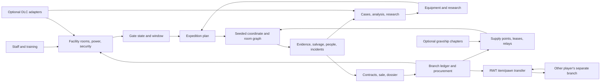

# Rimrooms - Async Industries: pre-production and complete implementation backlog

**Current content rule (owner, 2026-09-28):** [Repurpose existing game/mod content](CONTENT_REUSE_POLICY.md). Earlier instructions to create gameplay items, benches, sprites, textures or audio are superseded. Historical implementation facts remain evidence of the older build, not permission to ship those custom objects/assets. Original RimWorld-style Backrooms main-menu images are the approved visual exception; gameplay content must use existing providers.


**Purpose:** this is the master checklist from the current design folder to a releasable, polished RimWorld 1.6 mod. It includes work before code starts, the file/package work, every interconnected game system, all 294 local profile entries, RimWorld Together, all five DLCs, the two selected gravship chapters, verification, and release maintenance.

**Current state:** the active objective is every item in this full backlog. The [0.3.0-dev company wave](implementation/PHASE_3_BUILD_RECORD.md) adds hiring, procurement, facility observations, native-bench/book/audio reuse and the menu slideshow; that record owns its exact build result. Gate 0 documentation/source preparation is complete. The following 0.2.0 compilation/staging statement is historical evidence, not the current package identity. The [0.2.0 development slice](implementation/PHASE_2_BUILD_RECORD.md) has source and package content for the company scenario, gate/expedition/evidence loop, furnished saved AI-01, bounded layout selection/fallback, crew/cargo recovery, durable analysis reports, Gate Telemetry, Operations actions, original interior/equipment/encounter art and optional quiet cues with user audio settings. The integrated 0.2.0 package compiled with zero warnings/errors and its 61 installed files match the saved staging manifest; read the build record for exact receipts. Source completion and compilation do not close Gate 2: owner-launched gameplay, save/recovery, presentation and performance acceptance remain open, as do the Phase 3+ campaign and optional integrations. No optional integration or in-game Rimrooms acceptance result exists yet. The 294 rows are the full-profile research/test target; solo requires Core, co-op adds the RWT/Harmony stack, and other profile mods remain optional. The [Gate 0 decision sheet](GATE_0_DECISIONS.md) records D1–D9 and the supplemental family-level threat scope. The displayed title is exactly **Rimrooms - Async Industries**; author/publisher metadata is `Operator`. The [feature traceability map](FEATURE_TRACEABILITY.md) ties gameplay systems to design, lore, mod-profile rows, presentation, implementation surfaces, and acceptance evidence. Feature-specific runtime compatibility and API prototypes remain later implementation/acceptance work, not Gate 0 blockers. Start from the [source register](SOURCE_REGISTER.md), then use the [design plan](MOD_INTEGRATION_PLAN.md), [technical architecture](TECHNICAL_ARCHITECTURE.md), [game brief](GAME_DESIGN.md), [scenario contract](SCENARIOS.md), [research index](RESEARCH.md), [294-row register](../outputs/rimrooms-async-industries-register-2026-09-27/Rimrooms_Async_Industries_294_Mod_Integration_Register.xlsx), and [direct-linked video index](research/kane-pixels-video-index.csv).

## How to use this backlog

**Current sequencing override:** per the [owner's build-continuation direction](GATE_0_DECISIONS.md#build-continuation-and-deferred-game-testing), implement the remaining systems while game testing is deferred. Statements below requiring a gameplay gate before a later phase now govern acceptance/promotion, not permission to write that phase's source/content. Keep dependencies in order and leave runtime boxes open. The complete mod scope remains unchanged.

- Check an item only when its evidence or deliverable is saved in the project folder and reviewed.
- `BLOCKER` means the work must be done before that implementation phase begins. `GATE` items must pass before moving to the next phase.
- `DECISION` means owner direction is missing or needs to be made durable in the [Gate 0 decision sheet](GATE_0_DECISIONS.md). The current D1–D9 selections there are recorded owner decisions.
- Every code task needs a save/load path, a UI route, error handling, a dependency rule, and acceptance criteria. Avoid disconnected content that cannot be reached or used in the campaign.
- The 294 profile is a target integration list. A mod can be “integrated” by using its native feature, supporting it without patches, adding a narrow adapter, or documenting a verified conflict. Do not write needless patches just to claim a mod was touched.

## Locked direction from the owner

- [x] Target RimWorld 1.6; Royalty, Ideology, Biotech, Anomaly, and Odyssey are optional integrations. Keep the campaign playable on Core.
- [x] Start with a small corporate research/security facility, not the ordinary crashlanded start.
- [x] Provide distinct selectable campaign starts: Async Industries facility, Furniture & Knickknack Store breach, and Lone Survivor inside a seeded coordinate; build the facility opening first and preserve a shared scenario/generation contract.
- [x] Make the gate, expeditions, company management, money, hiring/training, security, procedural spaces, research, mysteries, entities, outposts, and expansion the central loop.
- [x] Use the 294-entry local server profile as the full research and test target, but require only RimWorld Core plus Harmony/RWT for multiplayer. Every other profile mod remains optional; the full profile is not yet compatibility-certified.
- [x] Official mod title: **Rimrooms - Async Industries**.
- [x] Use RimWorld Together for asynchronous cooperation: separate facilities, resources/item exchange, research dossiers, and (if supported and safely tested) shared research ledger and visits; no live shared-map control.
- [x] Include Vanilla Gravship Expanded Chapters 1 and 2 as optional late-game integrations.
- [x] Use Kane Pixels' series as the primary Backrooms story/lore source and review the A24 feature separately. Adapt the canon, lore, themes, and style indirectly rather than recreating specific scenes or characters; track the reviewed source for all adaptations.
- [x] First distribution target: private RimWorld Together prototype; consider public Steam Workshop release only after named-profile and multiplayer validation.
- [x] Displayed title stays exactly **Rimrooms - Async Industries**. Author/publisher metadata is `Operator`; MIT does not supply or alter that value. Package ID: `UnityLabAI.RimroomsAsyncIndustries`; internal C# namespace: `RimroomsAsyncIndustries`; semantic versions (`0.x` pre-release, `1.0.0` stable).
- [x] English-first, localization-ready; keep a Core-only solo path and use RWT for co-op. Original source code is MIT; art/audio licenses are tracked separately.
- [x] Audience: mature psychological horror/management, with the strongest horror presentation the game and tested profile can support.
- [x] Record the owner's supplemental scale, logistics, interface, main-menu showcase, and 294-profile direction in [GATE_0_DECISIONS.md](GATE_0_DECISIONS.md#supplemental-owner-direction-captured-during-preparation); apply it across the linked economy, scenario, integration, menu, and traceability contracts.

## Owner decisions that still affect the build

The recorded decisions are in [GATE_0_DECISIONS.md](GATE_0_DECISIONS.md). They are fixed for pre-production and implementation. The chosen code license does not cover third-party assets; record those separately.

## Phase 0 — pre-code blockers and research

### 0.1 Project ownership and product contract

- [x] Record D1–D9 in [GATE_0_DECISIONS.md](GATE_0_DECISIONS.md) and propagate the selected product, dependency, DLC, source, multiplayer, language, license, identity, and content-direction choices.
- [x] Define the “AAA-grade” acceptance bar in measurable terms: see [pre-production acceptance standard](research/PREPRODUCTION_ACCEPTANCE_STANDARD.md) and [performance benchmark plan](research/PERFORMANCE_BENCHMARK_PLAN.md). Reference machine RR-DEV-01, initial ceilings, paired profiles, procedures and evidence ownership are recorded. Measurements occur after a build and owner-operated RimSort launch.
- [x] Create a provenance register for source-specific names, text, character designs, visuals, sound, and equipment at [provenance-register.csv](research/provenance-register.csv). Preserve the owner's rights premise as an owner-provided statement; complete per-asset source/license entries before distribution and keep other mod publishers' files out of the project.
- [x] Define the optional-mod support and maintenance policy for the 294 optional profile mods in [OPTIONAL_MOD_SUPPORT_POLICY.md](research/OPTIONAL_MOD_SUPPORT_POLICY.md).
- [x] Record the mature-horror content direction, platform-questionnaire requirement, and accessibility baseline in [CONTENT_ACCESSIBILITY_BRIEF.md](research/CONTENT_ACCESSIBILITY_BRIEF.md). No formal age rating has been assigned.

### 0.2 Official-source review

- [x] Verify the official Kane Pixels playlist and establish a continuity/story review map for the 23 uploads; keep playlist order separate from in-world chronology: [Kane Pixels lore/story map](research/KANE_PIXELS_LORE_STORY_MAP.md).
- [x] Compile short story notes for all 23 entries in [the official Kane Pixels video index](research/kane-pixels-video-index.csv), using linked fan episode summaries. Capture the story beats, memorable spaces or threats, open mysteries, and one possible RimWorld hook; label this secondary coverage clearly in [Kane Pixels fan cliff notes](research/KANE_PIXELS_FAN_CLIFF_NOTES.md).
- [x] Write a separate, high-level A24 film note from the fan-maintained plot summary, covering its story, people, memorable spaces, and original scenario or quest ideas. The note is a secondary synopsis, not a direct review: [feature story note](research/reviews/a24-feature/feature-review.md).
- [x] Record the fan-guide supplemental-scope decision without changing the official 23-entry index: keep `Faultline.mov` as a separate companion lead with causality unresolved; exclude `Simpsons` from shipped scope because the fan guide attributes it to Laura Harris rather than Kane's official channel. Revisit creator-source details only if a planned feature needs them: [supplemental notes](research/KANE_PIXELS_FAN_CLIFF_NOTES.md#fan-identified-hidden-clips-outside-the-23-entry-playlist).
- [x] Freeze the first-pass source index to the 23 entries captured from the official playlist on 2026-09-27; keep the linked fan-summary uncertainty labels. Recheck official titles/captions only before a later feature depends on changed or unresolved source details. That conditional refresh is per-feature content work, not a Gate 0 blocker.
- [x] Mark candidate game content as an indirect Kane/A24 source cue or original Rimrooms design, keep the series and feature separate, and exclude broader community canon from shipped scope. `CAMPAIGN_CONTENT_CATALOG.md` labels its original mechanics and the Store's indirect A24 premise; `UNIVERSE_ADAPTATION.md` traces the source-to-game translations; `FEATURE_TRACEABILITY.md` provides each feature's saved source route and evidence labels.
- [x] Establish first-pass story coverage before source-specific content begins: 23 concise series fan summaries plus a separate feature fan-summary note, with source links and uncertainties labeled. Continue to resolve only source-critical questions in [FEATURE_TRACEABILITY.md](FEATURE_TRACEABILITY.md).
- [x] Read the official RimWorld 1.6 Modder Primer and current public mod-folder/load-folder guidance, then compare the package rules to the installed 1.6 data and the selected profile's exact manifests. Findings and remaining API questions are in [RimWorld 1.6 package and generation findings](research/RIMWORLD_1_6_PACKAGE_AND_GENERATION.md).

### 0.3 Individual review of the 294-mod profile

- [x] Preserve source load-order row, display name, package/Workshop ID, and config type in the CSV/workbook.
- [x] Give all 294 rows a preliminary system family, intended Backrooms use, dependency stance, and compatibility watch.
- [x] Record individual source facts for all 294 selected profile rows, including RimWorld Together, both gravship chapters, and high-priority facility, power, trade, quest, staff, custody, security/research, medical, storage, and defense mods; each note separates publisher/source claims from design use and what still needs a runtime check.
- [x] Complete the bounded source-review batches for all 294 rows under the [294-mod agent roadmap](research/MOD_REVIEW_AGENT_ROADMAP.md); lead intake, source notes, CSV/workbook fields, counts, and unresolved-source statements are synchronized. This closes source review only, not runtime compatibility.
- [x] Parse the exact 294 local `About.xml` records and declared load/dependency relationships; capture version declarations and absent `LoadFolders.xml` targets for follow-up. This is an installed-metadata snapshot only. See the [dated findings note](research/RIMWORLD_1_6_PACKAGE_AND_GENERATION.md), [metadata CSV](research/installed-mod-metadata-2026-09-27.csv), and [relationship CSV](research/installed-mod-relationships-2026-09-27.csv).
- [x] Inspect installed source/Defs/assembly surfaces for priority power, gate, turret, and gravship clusters; capture package/version evidence and reproduction leads in [priority interactions](research/PRIORITY_PROFILE_INTERACTIONS.md), the [power/gate/turret audit](research/POWER_GATE_AND_TURRET_SOURCE_AUDIT.md), [gravship interactions](research/GRAVSHIP_PROFILE_INTERACTIONS.md), and the [feasibility audit](research/RWT_AND_GRAVSHIP_FEASIBILITY.md). This source pass proves no co-load, menu, or multiplayer behavior.
- [x] Prepare the [power and gate acceptance cases](research/POWER_GATE_AND_TURRET_SOURCE_AUDIT.md); run them only after the Rimrooms gate exists. Core-only, power-mod, battery, turret, assembly, and Stargates! behavior remain post-build evidence, not a pre-code run requirement.
- [x] Compare the current local client `ModsConfig.xml` against server `ModConfig.json`: 294/294 IDs map, with zero missing/extra records and zero load-order differences on 2026-09-27. See [RWT and gravship audit](research/RWT_AND_GRAVSHIP_FEASIBILITY.md). This is a snapshot match, not a compatibility test.
- [x] Review the exact publisher/source route and local `About.xml` for every profile row; record current 1.6 declarations, dependencies, relevant asset/license statements, feature claims, and known incompatibilities, or state explicitly when a source does not publish or expose a fact. Official Core/DLC entries use official RimWorld documentation.
- [x] Map the exact pinned Core XML and managed-metadata entry points for each first-slice route in the [first-slice Core API source map](research/FIRST_SLICE_CORE_API_SOURCE_MAP.md). It separates verified local facts from Phase 1 decompilation/prototype work; resolve each listed call chain and behavior before implementing that feature. Before each optional adapter, inspect that mod's exact release and extension points; unrelated optional APIs remain staged by feature and do not block the Core-only first slice.
- [x] Record named RimWorld 1.6 generation candidates from Ludeon's primer and corroborating Core XML, with exact-vs-inferred API boundaries and the finite-coordinate design in [generation findings](research/RIMWORLD_1_6_PACKAGE_AND_GENERATION.md). Prototype signatures, save behavior, determinism, and path/return handling before relying on them.
- [x] Complete the agent batches and lead intake using the [294-mod review roadmap](research/MOD_REVIEW_AGENT_ROADMAP.md). All 294 rows have linked source-fact notes; none has runtime/profile clearance from source review alone.
- [x] Record the owner's direction for row 182, Questionable Ethics Enhanced: keep it optional and include it in the RWT candidate test profile despite the publisher warning; do not claim support until exact runtime evidence exists. See the [Gate 0 decision](GATE_0_DECISIONS.md#owner-direction-on-publisher-warned-mods).
- [x] Record the owner's direction for row 274, Medical Dissection: keep it optional and include it in the RWT candidate test profile despite the publisher warning; do not claim support until exact runtime evidence exists. See the [Gate 0 decision](GATE_0_DECISIONS.md#owner-direction-on-publisher-warned-mods).
- [x] Assign a source-based Rimrooms treatment to every row (native feature, configuration, narrow adapter, patch, optional/no touch, or unsupported/conflict) and keep its evidence status separate. Rows with untested behavior carry no compatibility promise; continue the interaction and runtime work below.
- [x] Capture the complete declared dependency/load-order inventory from the exact installed metadata: 914 relationship records, with the in-profile and external-target counts, exact packages, declaration types, and source paths in the [relationship CSV](research/installed-mod-relationships-2026-09-27.csv) and [declared-relationship audit](research/DECLARED_RELATIONSHIP_GAP_AUDIT.md). This closes the metadata extraction/counting pass only.
- [x] Build the [914-row conservative relationship disposition matrix](research/declared-relationship-disposition-matrix-2026-09-27.csv) from the relationship export and 294-row inventory, with stable record IDs, exact endpoint/package/order fields, feature tags and review paths when in profile, and relation-type project rules. The 266 feature-overlap candidate flags exclude `RR-COMPAT`; all 914 runtime statuses remain pending. This closes static row disposition only, not source confirmation or compatibility.
- [x] Reconcile every selected-profile declared relationship against the source snapshot and record its planned treatment in the [914-row matrix](research/declared-relationship-disposition-matrix-2026-09-27.csv). The former 280 “gaps” mean those exact edges were not repeated in review prose or the selective priority map; each is now retained with its stable ID, package/order fields, local `About.xml` path/hash, endpoint feature tags and review paths, and an explicit metadata-only classification where the review does not explain it. This is installed-metadata provenance and a proposed project rule, not publisher intent, source-code confirmation, or runtime compatibility. Remaining source conflicts or unclear publisher claims must be noted in the affected mod review before relying on them.
- [x] Close the semantic planning map for the actual Async Industries first playable in [FIRST_SLICE_MOD_INTERACTION_MAP.md](research/FIRST_SLICE_MOD_INTERACTION_MAP.md): it assigns each first-slice feature its candidate owner, relevant reviewed rows and provisional treatment, plus concrete post-build acceptance or explicit deferral. This does not close every optional pair or establish compatibility. The [relationship snapshot](research/installed-mod-relationships-2026-09-27.csv) has 914 records: 602 in-profile directed declarations (226 `Requires`, 371 `LoadAfter`, 5 `LoadBefore`, 0 `IncompatibleWith`) across 443 unique directed endpoint pairs; 60 incompatibility declarations target mods outside this profile. Keep the 266 metadata-linked overlap flags as triage, not presumed conflicts; resolve the exact source/API question before implementing each related feature or adapter and run compatibility cases only after a Rimrooms build exists.
- [x] Assign every one of the 294 selected profile rows at least one system/compatibility role, linked per-mod source review, proposed project treatment, evidence build, and acceptance status in the [294-row register](research/rimworld-server-mod-inventory.csv). The priority interaction map remains a curated high-risk/test queue rather than a duplicate 294-row catalog; rows absent from its prose are still mapped by their register feature IDs and individual reviews. The exported column `FinalDisposition` currently stores a provisional proposed treatment, not a final compatibility verdict. Preserve each QoL mod's function and key bindings where it remains selected; optional/no-touch or unsupported is a valid explicit treatment.
- [x] Review mods in system-family and high-risk batches with an individual source record for each member. Keep API and combined-profile checks open until the overlapping interactions are tested.
- [x] Set the register status for every row: 294 source-fact reviews accepted, zero pending source reviews, and zero combined-profile runtime tests. Keep those evidence levels distinct in both CSV and workbook.
- [x] Add and maintain `FeatureTraceIDs`, `ReviewRecord`, `ReviewStatus`, `FinalDisposition`, `EvidenceBuild`, and `AcceptanceEvidence` in the authoritative workbook and CSV. All 294 rows have linked accepted source-fact notes; no combined-profile runtime compatibility is established. See the [294-row register](../outputs/rimrooms-async-industries-register-2026-09-27/Rimrooms_Async_Industries_294_Mod_Integration_Register.xlsx) and [inventory CSV](research/rimworld-server-mod-inventory.csv).
- [x] Fill the six evidence/decision fields for all 294 rows with a feature ID, linked review, source status, planned treatment, exact evidence build, and either runtime evidence or `Not runtime tested`. Remaining cross-mod graph and interaction closure are tracked separately below.

### 0.4 RimWorld Together and gravship feasibility

- [x] Capture the local server executable product hash, client active package IDs, and ordered 294-entry list; map client package IDs through installed Workshop metadata and compare them with the server list. Results are recorded in [RWT_AND_GRAVSHIP_FEASIBILITY.md](research/RWT_AND_GRAVSHIP_FEASIBILITY.md).
- [x] Compare server `ModConfig.json` with the actual client `ModsConfig.xml`. They match exactly today; `AllowAllMods=true`, `EnforceSettings=false`, and null `ModOrder` mean the server does not enforce that match.
- [x] Review current official [RWT release notes](https://github.com/RimWorld-Together/Rimworld-Together/releases), the [Workshop page](https://steamcommunity.com/sharedfiles/filedetails/?id=3005289691), and official wiki guidance for offline activities. Record the likely fit and runtime uncertainties in the [RWT mod review](research/reviews/mods/3005289691-nova.rimworldtogether.md).
- [x] Pin the local RWT Windows server archive to published release 26.8.31.1 by matching its SHA-256 to the official release asset. Record the executable's embedded product-version commit separately; it is not the release tag commit.
- [x] Pin the local RWT server/client artifacts, five-DLC profile snapshot, Harmony metadata/assembly, and matching 294-entry client/server profile hashes. The RWT client assemblies byte-match release 26.8.31.1. The disposable startup logs report RimWorld 1.6.4871 rev591 from the byte-identified install; Steam build ID is 23969874. `Version.txt` and the profile snapshot say rev590, with the unexplained mismatch preserved as a static label. Verify the executable/Core assembly hashes and runtime-reported build on both clients before accepting multiplayer results; see the [runtime-smoke report](research/runtime-evidence/RWT_AND_FULL_PROFILE_STARTUP_2026-09-27.md).
- [x] Capture disposable Core+Harmony+RWT and full-294 `-quicktest` startup logs in the [runtime-smoke report](research/runtime-evidence/RWT_AND_FULL_PROFILE_STARTUP_2026-09-27.md). This confirms only that both launch paths reached their recorded startup/new-game steps; headless diagnostics and all multiplayer/gameplay limitations remain explicit, so it is not a compatibility pass.
- [x] Inspect the exact local RWT action/scenario config layout. Aid and Trade are enabled with cooldown 250; the local server enforces Crashlanded, while offline-visit availability is not exposed in the files inspected. Record hashes and limits in [RWT_AND_GRAVSHIP_FEASIBILITY.md](research/RWT_AND_GRAVSHIP_FEASIBILITY.md); do not change the live server.
- [x] Add the official RWT trading guide and upstream aid-state issue to the evidence path. Direct trade/gifts require both players online; include pawn identity/faction/health/equipment and reconnect checks in the [baseline test plan](research/RWT_BASELINE_TEST_PLAN.md).
- [x] Prepare the [RWT workflow run sheet](research/RWT_BASELINE_TEST_PLAN.md) for separate branches, visits, trade/gifts, cargo, aid, reconnect, recovery, and the owner's selected optional rows 182 and 274. Run these profiles only after a Rimrooms build exists; a completed case is not automatically a pass.
- [x] Document a disposable RWT server/client setup, profile matching, backup, and recovery procedure in the run sheet. Mixed vanilla starts and all other interactive RWT checks are post-build acceptance; the live server is not modified.
- [x] Pin the actual RWT Windows server and client release artifacts before coding. The local server archive matches the official `26.8.31.1` server asset digest; the installed `RTClient.dll`, `RTNetwork.dll`, and `RTShared.dll` byte-match the official client asset. Exact hashes and digest links are in the [feasibility audit](research/RWT_AND_GRAVSHIP_FEASIBILITY.md). Runtime behavior remains unverified.
- [x] Inspect the pinned RWT source/release tree for a documented client extension API. None was identified as of 2026-09-27; internal `RTClient.Hooks.*` and `RTClient.Patches.*` classes are not stable hooks. The wiki's JSON event/site configuration is a server-content candidate only, not a client API or shared-research support. Recheck only if the upstream release changes or a specific feature requires it.
- [x] Record the current Workshop feature/dependency/license statements and installed 1.6 metadata for [Gravship Expanded Chapter 1](https://steamcommunity.com/sharedfiles/filedetails/?id=3609835606) and [Chapter 2](https://steamcommunity.com/sharedfiles/filedetails/?id=3799737423); create one linked source review per chapter. Their likely conflict boundary and unfinished runtime evidence are explicit.
- [x] Map source-backed VGE/vehicle/cargo/space interaction families and label hypotheses separately in [GRAVSHIP_PROFILE_INTERACTIONS.md](research/GRAVSHIP_PROFILE_INTERACTIONS.md); the review establishes no compatibility result.
- [x] Inspect installed VGE Chapter 1/2 XML, load folders, assembly metadata, public interface candidates, VEF PipeSystem use, and conditional Insectoids 2 content. Record file hashes, local game-assembly mismatch, and limits in the [feasibility audit](research/RWT_AND_GRAVSHIP_FEASIBILITY.md); candidate public interfaces are not documented stable API promises.
- [x] Freeze the intended RWT dependency policy: Core + Harmony + RWT are required for co-op; the Rimrooms package will be a package dependency only after it exists; every other selected profile mod and DLC remains optional and receives its own evidence-based treatment. Actual join profile/order instructions are post-package acceptance.
- [x] Schedule validation of the co-op profile and custom-item exchange for post-build acceptance in Phase 4. Keep research, maps, gate state, company finances, and case authority branch-owned; implement dossier transfer or shared research only after a concrete extension path passes synchronization and recovery tests.

### 0.5 Pre-code design freeze

- [x] Record the first playable loop and milestone—facility → staffing → gate assembly/power/calibration → timed expedition → extraction → analysis → payment/research—in the [v0.1 first playable contract](FIRST_PLAYABLE_CONTRACT.md). This is a pre-code target, not a runtime result.
- [x] Create the canonical [scenario contract](SCENARIOS.md): shared state fields, Async Industries/Store/Lone Survivor openings, future candidate starts, multiplayer caveat, and acceptance checklist.
- [x] Write v0.1 map, pawn, inventory, gate/coordinate, objective, failure/recovery, and convergence cards for all three planned openings in [SCENARIOS.md](SCENARIOS.md); numeric values are tunable balance hypotheses, not final canon.
- [x] Name the first-slice staff, facility, field kit, room families, objective, evidence, reward, and teaching order in [FIRST_SLICE_CONTENT_INVENTORY.md](FIRST_SLICE_CONTENT_INVENTORY.md). This closes the first-slice roster only; it does not replace the full campaign content inventory.
- [x] Write v0.1 behavior sheets for the first route distortion and hostile encounter in [THREAT_DESIGN_SHEETS.md](THREAT_DESIGN_SHEETS.md). Later entities, town openings, containment, and space threats remain open and must have their own sheets before implementation.
- [x] Reframe the first-slice economy around a finite $50,000,000 branch allocation, million-scale deliverable payments, ordinary RimWorld production, and a separate physical inventory. Record opening payroll, food, reward, penalty, research, power, carry, rent, reputation, and outpost targets in [CAMPAIGN_ECONOMY_MODEL.md](CAMPAIGN_ECONOMY_MODEL.md) and the v0.2 workbook. These remain balance hypotheses, not tested results.
- [x] Draft and review the provisional player-facing tutorial in [TUTORIAL_SCRIPT.md](TUTORIAL_SCRIPT.md) against the first-slice content, threat, and economy contracts. The values remain balance hypotheses; in-game UX and runtime review remain open in Phase 5.
- [x] Specify mixed vanilla-start behavior as a post-build RWT acceptance case; do not run the game before the Rimrooms package exists. Record any shared-scenario limit in the co-op setup guide after the test.
- [x] Keep Async Industries, Furniture & Knickknack Store, and Lone Survivor RWT start tests after the relevant scenario content exists. Async Industries remains first playable; alternate starts follow the vertical slice.
- [x] Freeze separate branch ownership and the D6 exchange design: each player's ledger, research, facility, map, and case remain local; supported item transfers may carry resources and physical research dossiers; a shared research ledger is conditional on a documented RWT extension and safe synchronization tests; visits use only verified RWT activities. See [GATE_0_DECISIONS.md](GATE_0_DECISIONS.md#d6-how-players-exchange-technology) and [CAMPAIGN_STATE_DICTIONARY.md](CAMPAIGN_STATE_DICTIONARY.md). No supported client extension has been identified yet, so direct shared research is not part of the current supported co-op contract.
- [x] Create a full-campaign breadth map for progression, research branches, staff/work, facilities, evidence, mission families, threats, room archetypes, outposts, space content, localization, and accessibility in [CAMPAIGN_CONTENT_CATALOG.md](CAMPAIGN_CONTENT_CATALOG.md). Entries beyond the first slice are explicitly candidates, not a frozen release roster.
- [x] Freeze the full-campaign threat scope at broad family/anomaly level and defer the five named later-threat sketches by supplemental owner choice S1/B in [GATE_0_DECISIONS.md](GATE_0_DECISIONS.md). Keep the first playable roster bounded by [FIRST_SLICE_CONTENT_INVENTORY.md](FIRST_SLICE_CONTENT_INVENTORY.md). Before implementing any later named feature, return for owner approval and complete its behavior sheet, evidence/content list, unlock order, contract/incident set, room-template set, outpost/space depth, and balance targets; this is later feature work, not a Gate 0 blocker.
- [x] Define later-campaign money and logistics categories, quote requirements, stage progression, and non-duplication rules in [CAMPAIGN_ECONOMY_PROGRESSION.md](CAMPAIGN_ECONOMY_PROGRESSION.md). This is a rule map, not a full price list or balance result.
- [x] Extend the [v0.2 campaign economy workbook](../outputs/4b7976f0-1820-4ffa-a191-bf7c7f79b010/Rimrooms_Campaign_Economy_v0.2.xlsx) with editable 30-day account planning/downside cases for stages 2–7 and a Bulk Logistics sheet. The million-dollar ledger remains separate from item inventory; contract averages are planning stress inputs, not event payouts or final prices.
- [x] Cross-reference the active-profile OgreStack row 157, package ID, Core Silver's base stack limit/tag, and the publisher's default small-volume resource multiplier in the [economy model](CAMPAIGN_ECONOMY_MODEL.md), [OgreStack source review](research/reviews/mods/1447140290-Ogre.OgreStack.md), [interaction map](research/PRIORITY_PROFILE_INTERACTIONS.md#stack-size-cargo-and-shared-item-exchange-row-157--rows-122259--rwt), and workbook. The 67-stack profile-default and 2,000-stack Core-only calculations assume their stated settings; the active-save configuration is not runtime verified.
- [x] Prepare the [physical logistics acceptance plan](research/PHYSICAL_LOGISTICS_BASELINE_TEST_PLAN.md) for Core-only, OgreStack-default/active-settings, the selected full profile, pawn carry, storage, bounded delivery, and RWT ordinary cargo. Defer every gameplay measurement until after a Rimrooms build; compare these references with the Rimrooms kit/shipment cases and keep the Core-only fallback. Company USD remains separate from spawned silver.
- [x] Complete the code-free seven-stage economy category model in the [v0.2 campaign economy workbook](../outputs/4b7976f0-1820-4ffa-a191-bf7c7f79b010/Rimrooms_Campaign_Economy_v0.2.xlsx), [economy model](CAMPAIGN_ECONOMY_MODEL.md), and [progression rules](CAMPAIGN_ECONOMY_PROGRESSION.md): separate contract/service/lease receipts; specialist pay; replacement equipment; long expeditions; capped penalties; delayed/lost cargo and recovery/claim outcomes; optional VGE vehicle/gravship acquisition/operating costs; itemized outpost staffing, security, resupply, communications and evacuation; adaptive recovery cuts; no-contract cashflow; and milestone funding gates. All money values remain unapproved editable hypotheses. Owner review, runtime OgreStack/cargo verification, implementation, and Phase 5 balance tests remain open; this check closes only pre-code category modeling.
- [x] Complete the first-slice threat/distortion rules and counterplay in [THREAT_DESIGN_SHEETS.md](THREAT_DESIGN_SHEETS.md). Later threat families remain feature-level design tasks and must receive their own sheets before those features are implemented.
- [x] Define room-template tags, coordinate identity, procedural seed inputs, graph/path validation, bounded propagation rules, fog-of-war, return clues, map revisits, and generator migration behavior in [PROCEDURAL_SPACE_CONTRACT.md](PROCEDURAL_SPACE_CONTRACT.md). This closes design definition only; exact APIs, deterministic replay, saved-map behavior, and performance limits remain prototype/runtime evidence work.
- [x] Define the planned Operations panes and action preconditions/results/failure routes/state owners in [OPERATIONS_ACTION_CONTRACTS.md](OPERATIONS_ACTION_CONTRACTS.md). Optional panes remain conditional; implementation and usability checks are later work.
- [x] Record the campaign state dictionary, branch/map/object ownership, stable-ID categories, receipt idempotency, and migration expectations in [CAMPAIGN_STATE_DICTIONARY.md](CAMPAIGN_STATE_DICTIONARY.md), linked from `TECHNICAL_ARCHITECTURE.md`. Exact RimWorld save APIs and round-trip/migration tests remain later work.
- [x] Record the settled owner decisions and dependency/source-transfer direction, including rows 182 and 274 and supplemental S1/B. Save ownership is specified in the state dictionary; the bounded first-slice semantic map and API/source map are complete. Exact feature call-chain inspection/prototypes and all RWT gameplay verification are Phase 1+ work after a Rimrooms build.
- [x] Complete [FEATURE_TRACEABILITY.md](FEATURE_TRACEABILITY.md) as the feature index for all 17 planned feature IDs: validate local research/design links, all 294 row assignments, planned package surfaces, presentation rules, DLC/RWT boundaries, candidate state owners, and acceptance evidence. Runtime and final-profile evidence remain open in their separate checklist items.
- [x] Freeze the original [visual and audio style brief](research/VISUAL_AUDIO_STYLE_BRIEF.md) for facility, gate, Backrooms room families, furniture/salvage, staff/equipment, entities, evidence, Operations, and all scenarios; link source inspirations and label new rules as original. Per-asset provenance and permissions remain release-stage work.
- [x] Add the original main-menu Backrooms slideshow to the visual brief: cover each shipped scenario and implemented campaign systems, keep the menu readable, support reduced motion and disabling the mod backgrounds, and track every asset's provenance. This records art direction only; no images or menu integration have been produced or verified.
- [x] Trace the installed RimWorld 1.6 menu/background source surface and enumerate the exact-profile menu/UI/audio leads in [MENU_BACKGROUND_EXTENSION_AUDIT.md](research/MENU_BACKGROUND_EXTENSION_AUDIT.md). The native `ExpansionDef` random-background path is a source-backed candidate, not a verified public compatibility guarantee; the audit also records that native selection is not a timed slideshow. Keep vanilla/DLC background files untouched.
- [x] Freeze menu behavior requirements and record the installed source audit before code: original Backrooms art, readable menu controls, fallback, disable/reduced-motion controls, and no changes to vanilla/DLC files. The selected integration route remains an implementation decision.

### Coding-start gate

**Gate 0 passes only when:** D1–D9, the row 182/274 scope clarification, and supplemental S1/B (broad later threat families; names deferred) are recorded; exact RimWorld/Core, DLC, Harmony, and RWT client/server artifacts are identified by hashes, the previously recorded runtime-reported build and stale `rev590` label discrepancy are documented, and the intended client profile is reproducibly specified; all 23 series entries and the separate A24 feature have first-pass story notes with uncertainty labeled; all 294 rows have accepted source-fact notes, a linked record, feature mapping, a proposed treatment, and explicit evidence status; the declared dependency graph and proposed feature ownership are reconciled from exact package IDs, source disagreements are called out, and each first-slice overlap has an owner plus a source-backed disposition or a concrete future test/defer record; the pair-level test queue identifies concrete interaction questions without treating load order as proof or turning all 266 triage flags into presumed conflicts; first-slice power, logistics, RWT, save/recovery, and scenario test plans state exact profiles, cases, evidence fields, and post-build stages; and the feature/source/mod/style/file traceability map and first-slice contracts are complete. Gate 0 requires no RimWorld gameplay run. Execute the prepared in-game cases only after a Rimrooms build exists, in the relevant implementation/acceptance phase. **Do not create the Rimrooms code project, XML Defs, or production source-specific content before the documentation and source gates above pass.**

**Gate 0 documentation/source status (2026-09-28): PASS; no Gate 0 checklist items remain open.** The [completion audit](research/GATE_0_COMPLETION_AUDIT.md) maps each criterion to its substantive artifact and saves reproducible reference/anchor, 294-row workbook/CSV, 914-relationship and local target checks. It also records the named benchmark machine/budgets and the reviewed Hospitality 1.1.5 delta alongside the historical profile. D1–D9, supplemental S1/B, source coverage, first-slice contracts, API/source routes, package/launch plans and post-build acceptance plans are complete for preparation. At that historical checkpoint, Phase 1 could begin; Rimrooms code/assets were not yet implemented and runtime behavior/compatibility were unverified. Subsequent foundation and Phase 2 implementation evidence is recorded below. Every in-game case still requires a built package and owner-operated RimSort launch; the 295-entry product target normally becomes 296 loaded entries with the separately counted bridge overlay.

## Phase 1 — repository, build, and content foundations

- [x] Continue in the existing Git repository and use the authorized feature/preproduction-handoff → Prep → Develop → Main cascade separately on both remotes; ignore generated assemblies/logs/local references and add a contribution guide/code style.
- [x] Capture installed RimWorld managed assemblies and required reference DLL versions locally; never commit proprietary game or DLC assemblies.
- [x] Create a reproducible C# solution/project targeting the RimWorld 1.6 runtime/compiler constraints; record reference paths, build configurations, output path, and warning policy.
- [ ] Define RimSort-managed test profiles: preserve the 295-entry product target (the existing 294 plus Rimrooms), then record RimBridgeServer as a separate QA overlay (normally 296 loaded entries). RimSort owns sorting, saving mod lists, and every launch; the owner starts sessions through RimSort. Do not add direct RimWorld or GABS launch profiles or remove target mods to offset the bridge.
- [ ] After the first owner-launched full-target startup, collect matched Core/profile performance baselines on RR-DEV-01 and implement any missing counters per the [benchmark plan](research/PERFORMANCE_BENCHMARK_PLAN.md). Enforce the recorded budgets before promoting features or larger room/map bands.
- [x] Create build/package and staging scripts that emit a versioned, copyable `Mod/Rimrooms - Async Industries/` folder and copy only that folder to RimSort's configured Local Mods path; exclude local DLL references, docs, workbook, source files, logs, and third-party assets.
- [x] Create the mod identity files: `About/About.xml`, `About/Preview.png`, package IDs, supported versions, dependencies, description, and load folders. Use the selected title/package ID/version policy and set author/publisher to `Operator`.
- [x] Add README install/configuration/dependency guidance, changelog, credits, source/asset provenance ledger, version policy, bug report template, and save-migration policy.
- [x] Add `Languages/English/Keyed/` before UI strings are introduced; avoid visible hard-coded strings in C#.
- [x] Define namespaces/Def naming conventions, texture/audio conventions, stable IDs, XML validation rules, and file ownership boundaries.
- [x] Create a placeholder-free art/audio brief with resolutions, UI icon grid, palette, readability, animation, sound levels, and accessibility requirements.

**Foundation evidence:** [0.1.0 build/staging record](implementation/PHASE_1_BUILD_RECORD.md), [build guide](BUILDING.md), [contributor conventions](../CONTRIBUTING.md), [save policy](SAVE_MIGRATION_POLICY.md), and [production specification](research/VISUAL_AUDIO_STYLE_BRIEF.md#existing-content-bindings-and-presentation). Profile capture and runtime/performance acceptance remain open; the next code work is recorded in the build handoff.

### Planned mod package layout

```text
Backrooms/
  docs/                           design, research, and release planning; not shipped
  outputs/                        workbooks and research outputs; not shipped
  src/RimroomsAsyncIndustries.sln C# source and project files; not shipped
  tools/                          build/package/RimSort staging scripts; not shipped
  Mod/
    Rimrooms - Async Industries/  only loadable and copyable mod folder
      About/                      About.xml, Preview.png, required mod metadata
      LoadFolders.xml             Core and conditional DLC folders
      1.6/Assemblies/             built RimroomsAsyncIndustries.dll only
      1.6/Defs/                   scenario, building, item, pawn, work, research, quest, room defs
      1.6/Languages/English/Keyed/
      1.6/Patches/                narrow, package-guarded compatibility patches
      1.6/Textures/  1.6/Sounds/  original release assets
```

Confirm final folder conventions against RimWorld 1.6's loader. Keep tests, save fixtures, screenshots, logs, and release documentation outside the copyable package. The first product target is the existing 294-entry list plus Rimrooms (295), sorted by RimSort; the RimBridgeServer test overlay is additional and must be counted separately. The owner launches through RimSort; see the [RimSort package/launch plan](research/RIMSORT_PACKAGE_AND_LAUNCH_PLAN.md) and [RimBridgeServer harness](research/RIMBRIDGE_TEST_HARNESS.md).

## Phase 2 — code architecture and safe vertical slice

**Historical slice implementation:** [0.2.0 source/build record](implementation/PHASE_2_BUILD_RECORD.md). Scenario, gate, furnished saved first site, bounded candidate/fallback planning, expedition/cargo recovery, physical evidence and durable reports, initial payment/research, Operations, original assets and quiet audio/settings are present. Opt-in diagnostics exist; measurements have not been collected. The build record owns outstanding source findings, final compiler/package/staging receipts, the pending opening-time choice and owner-launched acceptance. Gate 2 remains open.

Unchecked tasks below retain their full stated implementation/acceptance scope; they do not mean all referenced source is absent. Use the linked system records in the build record before extending or reimplementing a service. This status reconciliation changes no task order, scope or checklist/gate result. The full Phase 3+ company systems, alternate starts, broader procedural campaign, optional adapters/co-op, main-menu slideshow and release work remain below.

### Core contracts

- [x] Implement a core campaign state owner for local branch identity, company ledger, project IDs, contracts, coordinate IDs, case IDs, and schema version. Source: [campaign implementation](../src/RimroomsAsyncIndustries/Company/), [saved ownership](SAVE_MIGRATION_POLICY.md); runtime persistence acceptance remains below.
- [x] Implement a versioned, data-driven scenario definition/initializer that applies one start exactly once, records its stable scenario ID, and routes generated starts through the shared coordinate/evidence/expedition services. Source: [scenario implementation](implementation/PHASE_2_SCENARIO_IMPLEMENTATION.md); actual reload/grant behavior still requires owner-launched evidence.
- [ ] Implement one authoritative gate state machine with validated transitions, actions, preconditions, costs, warnings, timers, and event log.
- [ ] Implement a single transaction service for stock/currency/job/project changes; prevent duplicate delivery/reward and never silently discard unsupported transferred items.
- [ ] Implement stable site/coordinate IDs, deterministic seed construction, generator version, room graph records, map ownership, revisit behavior, and bounded cleanup policy.
- [ ] Implement stable references to pawns/buildings/sites via game-supported serialization; avoid stale references and duplicated pawn inventories.
- [ ] Add structured log categories and debug summaries for campaign/coordinate/gate/contract/case/RWT operations. Include seed and failing stage for generated-site errors.
- [ ] Add versioned save components and migration from each released schema before saving or loading content updates.
- [x] Keep UI view models separate from simulation state so the Company Command layout can change without data migrations. [Operations source](../src/RimroomsAsyncIndustries/UI/) reads saved services; selected tabs/pawns, scroll and dialog entry fields are transient.

### Vertical slice implementation

- [ ] Create the Async Industries new-game scenario with starter facility, staff, stock, limited funds, disabled gate, first project, and tutorial, following `SCENARIOS.md`.
- [ ] Add gate frame, control console, power requirements, emergency cutoff, assembly/calibration work, operation feedback, failure states, and repair costs.
- [ ] Add staff role recommendations, field kit assignment, readiness checks, and basic company tasks while retaining vanilla pawn/work controls.
- [ ] Create one seeded, finite Backrooms site with a short room graph, one hazard, one learnable entity, one evidence chain, one exit/recall path, and one reward.
- [ ] Add expedition dispatch/recall/close flow; track crew/cargo/location/return and handle death, injury, missing, late return, and aborted runs.
- [ ] Add evidence intake, one lab analysis recipe/project, one researched capability, a payment/contract result, and a traceable company ledger entry.
  - Source is present in [investigation/settlement](implementation/PHASE_2_INVESTIGATION_IMPLEMENTATION.md); physical intake, once-only results and interrupted work remain runtime acceptance requirements.
- [ ] Save, reload, revisit the same coordinate, and confirm map state and unique rewards persist without duplication.
- [ ] Provide a safe fallback map and recoverable error message when generation cannot produce a valid route.

**Gate 2 passes when:** the first complete loop plays from a fresh save through build, staff, expedition, extraction, analysis, reward, save/reload, and a second visit without a softlock or lost state.

## Existing-content replacement work

The owner requires existing items, equipment, furniture and production benches throughout gameplay. The earlier custom physical-content implementation is superseded, not completed under this new requirement. Keep full functionality while replacing its content providers:

- [ ] Map every custom gameplay Def/asset and code consumer to existing Core/profile content, with exact provider/version and Core fallback; see [replacement map](implementation/EXISTING_CONTENT_REPLACEMENT_MAP.md).
- [ ] Replace custom gate/console/cutoff/generator objects with designated existing installed infrastructure and equivalent operator/power/emergency logic.
- [ ] Replace custom field gear, route aids and evidence items with existing objects plus saved functional/custody records; handle stack splits/merges, destruction, cargo and recovery without creating new item types.
- [x] Source: new AI-01 evidence uses an actual Core TextBook with once-only creation, saved physical custody, same-object recovery and ordinary-book isolation; see [evidence implementation](implementation/PHASE_3_EVIDENCE_BOOK_REUSE_IMPLEMENTATION.md). Legacy evidence remains readable and other field gear remains open.
- [x] Source: analysis and company research now use an explicitly designated existing Core research bench and its native speed factor. Native research remains available when company work is absent. See [laboratory implementation](implementation/PHASE_3_LABORATORY_REUSE_IMPLEMENTATION.md); save/job/runtime acceptance remains pending.
- [ ] Replace custom creature presentation, room fixtures and terrain with existing native/provider content, retaining learned rules, encounters, procedural variation and saved routes.
- [x] Source/package: replaced all four original gameplay sounds with existing Core cues; retained mute, visibility guards and text warnings. Original WAVs are archived outside the package. See [native audio reuse](implementation/PHASE_3_NATIVE_AUDIO_REUSE.md); listening/runtime acceptance remains pending.
- [ ] Define supported migration or explicit preserved development-save break before removing obsolete Defs; remove obsolete assets and references from the active package/allowlist once replacements exist.
- [ ] Reconcile all scenario grants, recipes, equipment readiness, content bindings and optional-provider absence against the existing-content-only policy. Source/build work continues while runtime cases remain deferred.

## Phase 3 — interconnected company simulation

### Scenario framework and alternate starts

Follow the [latest scenario setup and physical-door contract](SCENARIO_SETUP_AND_PORTAL_NETWORK.md) and [installed-provider/API review](implementation/SCENARIO_AND_DOOR_PROVIDER_SOURCE.md). Prepare Carefully bypasses the old pawn-page validation, so its final review must follow the native pawn page.

- [ ] Preserve native/Prepare Carefully edited pawn instances, relationships, inventory and role choice in all three starts; replace the historical fixed custom-kind roster checks with visible capability/role validation.
- [ ] Honor the company-selected surface world tile through native setup, and give the store its distinct setup/grant/objective flow.
- [ ] Implement the inside-start setup using the recorded provisional defaults while the grouped party/first-exit answers remain pending: direct Backrooms entry without a disposable surface colony, retained real-world state, discoverable physical exit and same-pawn/cargo transfer.

- [ ] Keep the first acceptance target on Async Industries while making its scenario setup consume the same versioned start contract intended for alternate starts.
- [ ] Implement Furniture & Knickknack Store after Gate 2: validate public-area security, store stock/ownership, basement threshold, missing-person objective, and return/contract convergence.
- [ ] Implement Lone Survivor after Gate 2: validate a seeded inside start, one-pawn survival, finite field kit, learned-rule/evidence persistence, return/rescue/outpost alternatives, and no facility prerequisite.
- [ ] Add outpost, town-distortion, or company-in-crisis starts only after a design brief defines their starting state, pressure, failure/recovery, and acceptance evidence.
- [ ] Verify every start's reload behavior, deterministic coordinate, objective idempotency, optional-DLC fallback, solo behavior, and RWT eligibility against `SCENARIOS.md`.

### Facility and personnel

Source checkpoint: [native applicants/hiring](implementation/PHASE_3_PERSONNEL_IMPLEMENTATION.md) and [HQ facility observations](implementation/PHASE_3_FACILITIES_IMPLEMENTATION.md) are implemented. The broader tasks below remain open because specialist recruitment, training, certifications, functional room roles, outposts and acceptance are not complete.

- [ ] Implement physical room functions: gate, control, labs, evidence archive, quarantine/decontamination, medical, armory, workshop, power, radio, receiving, storage, cafeteria, recreation, quarters, and outpost.
- [ ] Connect each room to concrete capabilities, stock needs, staff jobs, risks, and UI alerts; expose why a room is not functional.
- [ ] Add applicant/talent pools for candidates, specialists, contractors, survivors, returning staff, and referrals, with inspectable skills, health, traits, salary/term, and recruit action.
- [ ] Add configurable company roles, staff schedules, certifications, training jobs, field history, trust/stress/exposure and equipment familiarity; preserve pawn autonomy and vanilla skill/trait systems.
- [ ] Add cafeteria, sleep, recreation, injury recovery, shift rotation, staff needs, conflict/wellbeing alerts, and accommodation capacity.
- [ ] Integrate existing hospitality, guest, prisoner, medical, and QoL systems only through evidence-backed adapters; keep native interactions available.

### Gate, equipment, and expedition operations

- [ ] Implement native door/endpoint bindings for controlled and mysterious portals, including existing supported sizes, native recolor/aura and deliberate crossing actions.
- [ ] Bind actual control/laboratory equipment and native power grids/batteries to gate installations; show connection failures, consume real energy once and use researched upgrades for aperture, duration, efficiency and saved-coordinate recall.
- [ ] Migrate the older custom gate/console state or document a preserved development-save boundary; retain existing maps, endpoints, crews and cargo through interruptions.

- [ ] Add machine subsystems/upgrades: power reserves, calibration, stabilizers, monitoring, emergency cutoff, cool-down, modules, repair, and reliability.
- [ ] Add field equipment: protective gear, weapons, restraints, med kits, recorder/camera, radio/repeater, mapping gear, detector/scanner, beacon/tether, sample kit, cargo frame, portable power, and tools.
- [ ] Give every piece of gear a visible effect on detection, safety, information, cargo, route finding, or return reliability.
- [ ] Add crew composition and cargo planner with skill/health/weight/gate-window checks, ready/unready reasons, and cost preview.
- [ ] Add gate-window progression minutes → hours → days → weeks/months with power, heat, maintenance, supplies, crew rotation, communication, and increasing complexity costs.
- [ ] Add schedule, warning, recall, evacuation, emergency close, lost-connection, failed return, and rescue workflows.
- [ ] Add fog-of-war atlas, route notes, last-known position, evidence chain, return beacon, route clues, saved room graph, and revisit changes.

### Procedural sites and propagation

- [ ] Implement a tagged room/corridor library and deterministic topology generation by coordinate, mission, equipment, research, company tier, and saved history.
- [ ] Validate map size, accessible entrances/exits, walkable paths, mission objects, safe return clues, playable combat spaces, and generation budget.
- [ ] Add room families, furnishing rules, lighting/material palettes, loot, salvage, hazards, clue placement, threat events, and theme variations.
- [ ] Implement bounded non-Euclidean effects: repeats, moved door/exit, impossible adjacency across site links, altered room dimensions, topology loops, changed object/room identity, and controlled map transitions.
- [ ] Add saved, rule-based anomaly propagation across room graphs with observable clues, equipment detection, player countermeasures, cap/decay, event log, and deterministic save/reload.
- [ ] Make equipment meaningfully change what is detected or generated without breaking seed reproducibility or invalidating an already saved coordinate.
- [ ] Add map state versioning, archival, generator upgrades, explicit migration tests, and recovery if an old site cannot load.
- [ ] Bound active map count, pawn/thing count, graph search, event evaluation, and background tick cost; profile large, long-running saves.

### Economy, contracts, and evidence

Source checkpoint: the [0.3.0-dev wave](implementation/PHASE_3_BUILD_RECORD.md) implements Core-goods quotes, physical supplier custody, payment/refund reconciliation, partial delivery, rerouting, bounded history and native-book evidence creation. Shipment incidents, broader contracts/evidence and observed runtime acceptance remain in the full tasks below.

- [ ] Implement branch-local USD financial ledger with auditable entries, payroll, upkeep, purchases, shipments, contract advances, salvage, penalties, compensation, and profit report. Keep ledger balances separate from physical silver/items and prevent duplicate posting.
- [ ] Implement equipment/material procurement, source/price/deadline, shipment manifest, receiving area, delay/loss/damage events, cancellation, and delivery receipt.
- [ ] Implement contract/quest templates for surveys, retrieval, furniture/salvage, samples, transcripts, rescue, containment, security, lease/site construction, town distortion, outpost delivery, and gravship support.
- [ ] Generate bounded story variations from client/faction, coordinate, staffing, discovered rules, company tier, previous outcomes, opening duration, and available equipment.
- [ ] Add space leasing/claiming with cost, boundaries, term, access/security requirements, maintenance, renewal, eviction, and exit/abandonment consequences.
- [ ] Implement evidence provenance/custody/type/value/risk/confidence, sample storage, research value, sale value, client deliverable, archive, chain of custody, and destruction choice.
- [ ] Add analyze/interview/compare/review workflows for equipment, furniture, people, entity remains, recordings, transcripts, route notes, and recovered documents.
- [ ] Add repeated missing-person mysteries with radio fragments, missing crews, delayed return, witness conflict, reappearance/death, rescue, and case closure.
- [ ] Make sale/study/use/contain/release/recruit/detain/transfer choices visible with financial, staff, faction, legal-in-world, trust, and security consequences.

### Research, entity, and expansion progression

- [ ] Define research IDs, tier gates, evidence prerequisites, benches, labor/cost, alternative discovery routes, unlocks, dossier output, and fallback when optional research mods/DLC are absent.
- [ ] Complete research branches for facility/power, engineering, field safety, equipment, mapping, communication, stability, containment, medicine, logistics, commerce, orbital operations, and deep topology.
- [ ] Author entity/anomaly design sheets first: appearance/readability, AI rules, triggers, limits, interaction, tells, counters, evidence, study risk, capture/storage, sale value, and fail states.
- [ ] Implement containment rooms, security procedures, prisoner/witness interviews, staff debrief, quarantine, alarm/escape response, evidence custody, and case records.
- [ ] Implement anomaly openings at ordinary RimWorld settlements as timed quests with perimeter, rescue, evidence, witness, close/stabilize, and follow-up objectives.
- [ ] Add outside-gate and inside-site radio stations, supply points, relief teams, depots, guarded space rental, research/shelter outposts, servicing, loss/evacuation, and return routes.
- [ ] Add vehicles and space travel as logistics branches; maintain the gate as the defining Backrooms access mechanism.
- [ ] Add VGE Chapter 1 logistics summary/operations links without replacing its oxygen/fuel/power/heat/crew systems.
- [ ] Add VGE Chapter 2 orbital security/contracts/wreck salvage hooks without patching its gravship internals or mixing orbital enemies into Backrooms entity generation.

## Phase 4 — multiplayer, DLC, and the full profile

### RimWorld Together adapter

- [ ] Implement feature detection and setup diagnostics for the pinned RWT release; support unavailable/admin-disabled feature states.
- [ ] Implement no custom server schema or patches until supported extension points are identified from the exact code version.
- [ ] Verify guild identity, facility mapping, configured visits/snapshot behavior, visits when online/offline, transfer spot, chill/defense spots, caravan interactions, events, sites, roads, aid, gifts, and trading.
- [ ] Verify transfer receipt IDs and item/pawn state prevent duplicates, loss, stale ownership, and broken stacks on disconnect/reconnect.
- [ ] Verify Backrooms Research Dossier item transfer; receiving branch must explicitly study it locally and be unable to claim it twice in one save.
- [ ] Test unsupported/complex modded items and define an honest fallback message rather than promising an unverified transfer.
- [ ] Test separate colony saves, shared world actions, mod order/config enforcement, RWT server restart/backups, and an admin changing settings during play.
- [ ] Document exact server setup and player experience. No statement may describe live shared-colony control or synchronized research unless implemented and demonstrated.

### Five DLC layers

- [ ] Base Core-only campaign works and loads with every DLC absent.
- [ ] Royalty conditional content: titles/quests/faction/psycasts only as optional company routes.
- [ ] Ideology conditional content: beliefs, meditation, rituals, staff policies, and recreation only when available.
- [ ] Biotech conditional content: genes, mechanitors, children, medicine, pollution, and mechanoid options; no mandatory gene/resource dependency.
- [ ] Anomaly conditional content: containment/research links; Backrooms entities retain a base-game implementation.
- [ ] Odyssey conditional content: gravship/off-world logistics and any compatible space travel.
- [ ] Before implementing or advertising optional VGE support, verify the clean Core + Harmony + Odyssey + VEF + both VGE chapters stack, Chapter 1 operations, Chapter 2 threat/defense/salvage, optional Insectoids 2, save/reload, and the gravship-touch profile graph. Keep this in the per-integration acceptance gate; it is not a Gate 0 requirement. See the [gravship profile review](research/GRAVSHIP_PROFILE_INTERACTIONS.md).
- [ ] Verify all five individually enabled/disabled, then all combined. Maintain a 32-row DLC bitmask matrix (all combinations of five DLCs) if claiming full combinatorial support; at minimum, explicitly publish exactly which combinations were run.
- [ ] Check DLC-only XML folders, Def references, textures, recipes, quests, C# type lookups, startup without DLC, and save load after toggling DLC.

### All 294 profile entries

- [ ] Pin the exact profile and test clean Core, Core+RWT/Harmony, selected VGE stack, each high-risk family, and the full ordered profile.
- [ ] For each workbook row, close its status with evidence: reviewed version, load-order placement, applicable DLC, behavior used/preserved, patch/adaptor/no-code reason, and result.
- [ ] Verify all QoL features remain available, including work-priority, UI, scheduling, storage, movement, hauling, selection, visitors, prisoners, health, combat, map, and scenario helpers represented in the list.
- [ ] Resolve duplicate Defs/patch collisions in the exact 294 profile; use load-after patches only where a reproducible conflict requires one.
- [ ] Test gravship-changing profile mods against both VGE chapters; publish incompatible combinations rather than hiding known conflicts.
- [ ] Add a user-facing compatibility report with tested order, versions, DLC, known issues, unsupported features, and save caveats.

## Phase 5 — complete Company Command interface and polish

- [ ] Build the Operations overview and panes: Overview, Personnel, Facilities, Gate, Expeditions, Atlas/Routes, Research/Evidence, Contracts/Ledger, Cases/Containment, Outposts/Company Network, Gravship Operations.
- [ ] Make each screen deep-link to the relevant pawn, building, map, quest, item, research project, evidence record, contract, or RWT site.
- [ ] Add explainable alerts, reason codes, action previews, confirmation only for irreversible losses, undo/recovery where possible, and clear empty/loading/error states.
- [ ] Remap RimWorld's menus, tabs, and campaign views into the finished company-first Company Command layout, growing from the first-playable Operations tab. Keep every relevant Architect, Work, Assign, Research, World, map, building, and pawn action reachable; change navigation and presentation without replacing the underlying colony simulation.
- [ ] Add tutorial/guide, help glossary, keyboard/controller paths as appropriate, color/contrast/readability options, scalable UI, icons/tooltips, and localization support.
- [ ] Replace the historical custom gameplay items, benches, terrain, sprites and audio with source-verified existing Core/profile content and saved role bindings; preserve the gate, field gear, evidence, threat and discovery functions. Follow `CONTENT_REUSE_POLICY.md` and the existing-content replacement map.
- [x] Source/art: two original painted menu images, the controller/settings, quiet crossfade and dynamic title/version are present; see [menu implementation](implementation/PHASE_5_MENU_IMPLEMENTATION.md) and [art record](implementation/PHASE_5_MENU_ART_V2.md). In-game presentation checks remain in the full tasks below.
- [ ] Create and integrate the approved original RimWorld-style Backrooms main-menu slideshow, preserving provenance, native fallback, supported crops and truthful feature coverage. Show the exact mod title and loaded version beside native top-left version information; use dynamic UI text, not baked image version labels.
- [ ] Integrate the slideshow through the verified 1.6 menu surface without redistributing vanilla/DLC art; keep a disable/fallback route and test it alongside the profile's menu-changing mods.
- [ ] Review every slideshow image with the actual menu overlay across supported aspect ratios, resolutions, and UI scales; check text contrast, crop safety, quiet transitions, reduced-motion behavior, and no-audio use.
- [ ] Review text length, font scale, combat readability, motion sensitivity, audio levels, UI overlap at supported screen sizes, and translations.
- [ ] Verify no UI panel conceals urgent health, fire, power, missing crew, gate recall, containment, or contract deadlines.

## Phase 6 — QA, balance, and release

- [ ] Validate Def references, language keys, patch targets, load folders, package metadata, missing textures/audio, logs, build output, and clean-install folder structure.
- [ ] Create a reproducible fresh-start/save/reload/revisit checklist and automated or manual fixtures for deterministic room generation, gate transitions, ledger idempotency, transfer receipt IDs, and schema migration.
- [ ] Run the scenario acceptance checklist for every shipped opening: fresh start, reload, failure/recovery, route back to the shared campaign, and optional-mod/DLC absence.
- [ ] Exercise invalid states: insufficient power, no operator, blocked route, missing exit, destroyed gate, overloaded expedition cargo, receiving bay full, split/delayed bulk shipment, missing/changed OgreStack setting, dead/missing crew, unsafe return, destroyed relay, unavailable RWT feature, failed item transfer, missing DLC, bad mod order, and old save migration. Include a one-million-silver case: 67 stacks under the active OgreStack default assumption, 2,000 under Core limits; verify actual in-save settings and record hauling/storage/transfer results.
- [ ] Check performance on worst-case room graphs, multi-outpost company, long play time, many evidence/case records, visitors/prisoners, active threats, and gravship combat.
- [ ] Balance economy and progression from fresh-start play through late game; check grind, runaway money, research skip routes, dead-end tech, exploitative optimal choices, and difficulty scaling.
- [ ] Verify the full mod list one final time and capture game/RWT/DLC/profile versions, settings, logs, save, known compatibility issues, and results in a release report.
- [ ] Test clean install/uninstall, load order, Workshop update, dedicated RWT server setup, player join, server backup/restore, save migration, and rollback to previous mod release.
- [ ] Prepare final mod page, description, feature list, screenshots, trailer/preview art, installation guide, dependencies, DLC matrix, RWT setup, credits, source provenance, license, FAQ, known issues, and update/support plan.
- [ ] Tag release, archive exact source and build artifacts, preserve a known-good server profile, and publish only features that passed their listed acceptance criteria.

## Cross-system contracts that must remain true



- A crew cannot be dispatched unless a powered/stable gate, valid plan, eligible crew, and return policy exist; every failed precondition is explained.
- Equipment selected for a run must become the actual pawn/caravan/map gear and be accounted for on return, loss, consumption, sale, or transfer.
- Every evidence item links to a coordinate and acquisition event; every analysis result links to an evidence source and an unlock/case/contract outcome.
- Research unlocks gear, building, policy, site generator, or contract content that the player can identify and use; no invisible unlocks.
- Each contract's reward/penalty posts exactly once to the owning branch ledger and uses traceable evidence/cargo receipts.
- Every outpost/lease consumes an explicit upkeep/supply budget, communicates with known relays, and supports resupply/evacuation/abandonment.
- RWT can move supported items/pawns only; it does not merge two local ledgers, gate states, map saves, or research trees by implication.
- Apply the D3/D4 dependency contract: if DLC or profile mods are optional, they never become the sole way to repair the gate, support the starting crew, finish the first mission, or continue the campaign.
- Generated complexity can increase without invalidating the player's only known route home or silently mutating saved maps.
- Every threat rule disclosed to the player has a discoverable clue; every failure leaves a readable event/case record.

## Current readiness summary

**Status reconciliation, 2026-09-28:** the rows below describe current source/artifacts and required next evidence. Historical Gate 0 records remain preparation evidence. Earlier successful compiler snapshots are not receipts for later source/package edits; consult the [Phase 2 build record](implementation/PHASE_2_BUILD_RECORD.md) for the exact final build and staging state. This documentation update performed no build, tests or game run and closes no gameplay or compatibility gate.

| Workstream | Current state | Required next evidence |
| --- | --- | --- |
| High-level game design | The Async Industries contracts now have corresponding first-slice implementation, including furnished rooms, physical clues/salvage, recovery and evidence reports. Broader campaign/scenario/economy contracts remain future work. The earlier menu request has two unshipped candidate images and source inspection; its original-art exception is approved, including top-left mod title/version display. Gameplay content is being rebased to existing providers. Amounts, timers and outcomes remain provisional balance values. | Resolve the recorded opening-time direction, review the tutorial and first loop through owner-launched acceptance, then implement later campaign content in the stated phase order. Complete menu integration and balance evidence before release. |
| 294-mod inventory | 294 rows have accepted source-fact notes and linked review records. Rows 96, 237, and 278 received direct publisher-source follow-up; source gaps, warnings, and untested behavior remain explicit. The 914-edge matrix preserves declarations and proposed metadata-only treatment. The first-slice interaction map routes each actual opening feature to its owner, relevant rows, and a concrete post-build check or defer. No row or combined profile has runtime compatibility clearance. | Before each feature/adapter, resolve its exact source/API question and maintain its row-level route. Run only the checks applicable to that built feature/profile, then record results before claiming support. The 266 overlap flags are triage, not presumed conflicts. |
| RimWorld Together | Local 294-entry client/server set/order match; local game, Harmony, server archive, and client assemblies are pinned, with client assemblies byte-matched to release 26.8.31.1. Aid/Trade are enabled; offline-visit availability is unknown; Crashlanded is enforced. Direct trades/gifts require both players online according to the official guide. The [RWT run sheet](research/RWT_BASELINE_TEST_PLAN.md) and [RimBridgeServer harness](research/RIMBRIDGE_TEST_HARNESS.md) are prepared for isolated post-build acceptance. | After a Rimrooms build exists, check the scoped visit, separate-start, trade/gift, aid, reconnect, and save-recovery cases on disposable clients/server; keep branch state local and shared research disabled until an extension and synchronization path is proven. |
| VGE Chapters 1 and 2 | Installed entries, dependency order, official requirements, and source-backed interaction candidates are recorded in the [profile review](research/GRAVSHIP_PROFILE_INTERACTIONS.md). Their late-game roles are conditional proposals; orbital scope, APIs, and full-profile compatibility are not verified. | Inspect the extension points and chapter scope, then run a clean stack and add gravship-touch profile families in stages. |
| DLC | D4 selected: all five optional; Core-only campaign. | Def folder audit and selected-profile runs; record every declared combination. |
| Kane Pixels videos/A24 film | All 23 indexed uploads have concise linked secondary story notes; the A24 feature has its own fan-summary story note. The supplemental scope decision is recorded. The four video review files still contain only partial direct samples. | Keep movie continuity separate and check official sources only for unresolved details that matter to planned features. |
| Code/package | The C# project, native XML package, build/staging tools and Phase 2 services exist. The 0.1.0 foundation has historical build/staging evidence, and earlier 0.2.0 source snapshots compiled successfully. The historical 0.2.0 compiler and 61-file staging receipts are saved; that package predates the existing-content-only instruction and now needs the replacement work above. No Rimrooms gameplay acceptance has run. | Finish outstanding source findings and preserve the final compiler/package/reference/staging receipts. Keep repository source/docs outside the copyable mod. The owner alone activates, sorts and launches the 295-entry target through RimSort; attach RimBridgeServer afterward as the separate QA overlay. Record actual load, loop, recovery, save/revisit and performance results before closing Gate 2. |
| Assets/release identity | Exact title, package ID and `Operator` metadata are implemented. The package preview, original equipment/encounter sprites, interior carpet/fixture art and four original short audio cues have source/provenance records. Gate/field mute and cue volume settings are implemented. The owner superseded custom gameplay art; remaining historical objects/assets require provider replacement. Original menu images remain approved. Runtime presentation/listening review remains open. | Confirm the current package allowlist/provenance during the final build, then review actual zoom, UI scale, floor tiling, lighting, sound mix and mute behavior after owner launch. Complete existing-content replacement and the approved original main-menu slideshow before release; never resume a custom gameplay asset-production backlog. |

Gate 0 documentation/source criteria pass, repository foundations exist and the Phase 2 first-expedition source is implemented in development. The integrated 0.2.0 compiler/package/staging receipts are saved. Complete the owner's RimSort acceptance sequence before promoting Gate 2; compilation does not establish gameplay acceptance. No RimBridgeServer Rimrooms test or runtime compatibility clearance is recorded. Hiring/training, procurement/shipments, generated contract families, broader research, outposts, alternate starts, town cases, containment, optional integrations/co-op, menu slideshow, balance and release work remain in Phases 3–6. RimSort continues to own the profile and launch; RimBridgeServer is only a post-launch QA overlay.
