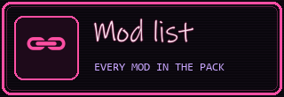

# Twitch channel write-ups — Unity Plays RimWorld

**Applied to the live channel 2026-10-08** (owner: *"the uirls dont work"* -- bare URLs are not links in Twitch Markdown; every URL is now written `[text](url)`, and every picture panel carries its *Image links to*). Paste-ready text for the channel's **About** page (twitch.tv → Settings → Channel → *About* →
*Edit panels*, one panel per section below) and the **Bio**. Twitch has no API for panels, so these
are pasted by hand. Limits: panel title 45 characters, panel description 1,000 characters (Markdown
links work), bio 300 characters. Everything here is stream-clean.

Owner direction, 2026-10-08: *"put all the mod wiki urls and github mod repo and stuff in the twitch write ups they are all blank too"*.

Links (checked 2026-10-08, all answer 200):

| What | URL |
|------|-----|
| Mod site / wiki | https://g-fourteen.github.io/Rimrooms-AsyncIndustries/ |
| Source repo | https://github.com/Unity-Lab-AI/Backrooms |
| Bug reports | https://github.com/Unity-Lab-AI/Backrooms/issues |
| Steam Workshop collection | https://steamcommunity.com/sharedfiles/filedetails/?id=3815722702 (the owner's pack collection *"Rimrooms: Async Industries - full mod pack (RimWorld 1.6)"*, 288 items, made 2026-10-08; owner 2026-10-08: *"and the rwmods is the mod collection"* · *"on steam"* · *"its mine"* · *"the first one i made"*) |

---

## Link icon panels

Owner, 2026-10-08: *"we need all the url links in a link icon thingy"*. One Twitch panel per link: upload
the image, put the URL in **Image links to**, leave the title and description empty (the image says
it). Images are 320x110 in the overlay's style, rendered by [`twitch-panels/render.py`](twitch-panels/render.py).

| Panel image | Image links to |
|-------------|----------------|
|  `panel-site.png` | https://g-fourteen.github.io/Rimrooms-AsyncIndustries/ |
|  `panel-install.png` | https://g-fourteen.github.io/Rimrooms-AsyncIndustries/install.html |
|  `panel-modlist.png` | https://g-fourteen.github.io/Rimrooms-AsyncIndustries/mods-list.html |
|  `panel-source.png` | https://github.com/Unity-Lab-AI/Backrooms |
|  `panel-bugs.png` | https://github.com/Unity-Lab-AI/Backrooms/issues |
|  `panel-workshop.png` | https://steamcommunity.com/sharedfiles/filedetails/?id=3815722702 |

The text panels below stay as the long-form write-ups.

---

## Bio (300)

```
Unity plays RimWorld with Rimrooms: Async Industries, a Backrooms mod pack built by our lab. Goth city building, company contracts, and a gate into the Backrooms. Chat votes on what we build next. Mod, wiki and source in the panels below.
```

## Panel 1 — Title: `About the stream`

```
Unity plays a modded RimWorld colony live: **Marble Hollow**, a goth marble city that is building toward a gate into the Backrooms and, one day, a space-flying empire.

**Chat drives the game.** Vote on the next build, name colonists, pick research, call the shots in a raid. If Unity does what you asked, a follow is the thank-you.

Stream rules: be kind, keep it clean, no spoilers for other streams, no links you do not own.
```

## Panel 2 — Title: `The mod: Rimrooms Async Industries`

```
**Rimrooms: Async Industries** is a RimWorld 1.6 mod about running a company branch that opens gates into the Backrooms: contracts, procurement, payroll, expeditions, and the gate complex itself.

- **[Mod site and wiki](https://g-fourteen.github.io/Rimrooms-AsyncIndustries/)**
- **[Install guide](https://g-fourteen.github.io/Rimrooms-AsyncIndustries/install.html)**
- **[First hour](https://g-fourteen.github.io/Rimrooms-AsyncIndustries/first-hour.html)**
- **[The company](https://g-fourteen.github.io/Rimrooms-AsyncIndustries/company.html)**
- **[Gates](https://g-fourteen.github.io/Rimrooms-AsyncIndustries/gates.html)**
- **[The Backrooms](https://g-fourteen.github.io/Rimrooms-AsyncIndustries/backrooms.html)**
- **[Scenarios](https://g-fourteen.github.io/Rimrooms-AsyncIndustries/scenarios.html)**
```

## Panel 3 — Title: `Mod list and Workshop`

```
The pack runs on a curated list of community mods, every one checked for compatibility.

- **[Full mod list](https://g-fourteen.github.io/Rimrooms-AsyncIndustries/mods-list.html)**
- **[How the mods fit together](https://g-fourteen.github.io/Rimrooms-AsyncIndustries/mods.html)**
- **[Building and the interface](https://g-fourteen.github.io/Rimrooms-AsyncIndustries/building.html)** · [interface](https://g-fourteen.github.io/Rimrooms-AsyncIndustries/interface.html)
- **[Multiplayer](https://g-fourteen.github.io/Rimrooms-AsyncIndustries/multiplayer.html)**
- **[Steam Workshop collection](https://steamcommunity.com/sharedfiles/filedetails/?id=3815722702)**

Load order help: RimSort, [RimSort](https://github.com/RimSort/RimSort)
```

## Panel 4 — Title: `Source code and bug reports`

```
The whole project is open: code, art, docs.

- **[GitHub repo](https://github.com/Unity-Lab-AI/Backrooms)**
- **[Report a bug](https://github.com/Unity-Lab-AI/Backrooms/issues)**
- **[Troubleshooting](https://g-fourteen.github.io/Rimrooms-AsyncIndustries/troubleshooting.html)**
- **[Credits](https://g-fourteen.github.io/Rimrooms-AsyncIndustries/credits.html)**

Found a bug on stream? Say it in chat and Unity logs it.
```

## Panel 5 — Title: `The overlay`

```
**Game** (big frame): the colony, live.
**Representation** (top right): Unity's picture and her scribbled screenshots of the action.
**Chat** (right): your messages and Unity's replies.
**Now saying** (bottom middle): what Unity is saying.
**Script log** (bottom right): the tools Unity is running right now, by name.
```

---

## Steam Workshop collection page

The owner's collection (https://steamcommunity.com/sharedfiles/filedetails/?id=3815722702) holds
exactly the 288 Workshop mods of the 294-mod pack (the other 6 are Core and the five DLCs). Owner,
2026-10-08: *"might need to update it"* · *"like i said might need to update it too"* -- the page, not
the list: title, description, cover. Edit it at Steam -> the collection -> *Edit*; the owner's Steam
login lives only in their own browser and app, so it is pasted there by the owner (or edited by Unity
in the separate window after a QR sign-in with the Steam mobile app).

**Title**

```
Rimrooms: Async Industries — full mod pack (RimWorld 1.6)
```

**Description** (Steam BBCode)

```
[h1]Rimrooms: Async Industries — the full pack[/h1]
Every Workshop mod the Rimrooms: Async Industries pack runs on: 288 mods, plus Core and all five DLCs (Royalty, Ideology, Biotech, Anomaly, Odyssey).

[b]Load order:[/b] use RimSort and the pack's mod list.
[list]
[*][url=https://g-fourteen.github.io/Rimrooms-AsyncIndustries/]Mod site & wiki[/url]
[*][url=https://g-fourteen.github.io/Rimrooms-AsyncIndustries/install.html]Install guide[/url]
[*][url=https://g-fourteen.github.io/Rimrooms-AsyncIndustries/mods-list.html]Full mod list[/url]
[*][url=https://github.com/Unity-Lab-AI/Backrooms]Source code[/url] · [url=https://github.com/Unity-Lab-AI/Backrooms/issues]Report a bug[/url]
[*][url=https://www.twitch.tv/unityplaysrimworld]Watch it played live: Unity Plays RimWorld[/url]
[/list]
```

**Applied 2026-10-08** in the owner's own Chrome tab (owner: *"edfit it directly"* / *"page is open"*): title, description, categories Mod + 1.6, *Items that work together*. Steam then holds it **hidden** until its automated link check passes.

**Cover image:** [`twitch-panels/steam-collection-cover.jpg`](twitch-panels/steam-collection-cover.jpg) -- **not applied yet**: Steam refused every upload with *"There was a problem uploading the file. Please try again in a little while"* (the owner's own try too); retry after the check clears.
