# The assets

**Everything listed here is original to this project.** Nothing is copied from another mod, and nothing is extracted from the game.

Where Rimrooms uses one of the game's own pictures or sounds, it names the path and the game provides it while you play — that file is not in this package and is not on this page.

**52 drawings and 17 sound cues — 69 entries from 99 files, 24652 KB in total.**

This page is generated from the package itself on every build, so it cannot drift from what actually ships.

## How to read this page

**Search the table and sort it by any column.** Click a heading to sort, click it again to reverse. The search box filters every column at once, so typing *gate* finds the frames, the animation and the cues together.

A building that can be rotated needs a separate drawing per direction. The game mirrors west from east for free; nothing else is free. A rotatable set is **one row with one picture**, because three facings are one drawing and not three assets.

**`one frame` identifies a fixed pose or interface icon.** The closed journal and Set Gate button need one picture; the journal's reading poses and directional equipment have their own facing sets. Rectangular sets list both pixel sizes because turning them swaps their width and depth.

**A sound cue has no picture, so its preview is a dash.** It is in the same table rather than a separate one, because a reader asking what this mod ships wants one list.

**The pictures are checkerboarded behind.** Most of these textures are mostly transparent — a gate frame is an outline around a hole — so the squares are there to show you where the transparency is instead of hiding it against a flat colour.

## What is in here

| Kind | How many | What it is |
|---|---|---|
| **Menu background** | 12 | A painting behind the main menu. Twelve, shown in turn. |
| **Building** | 7 | Something the company builds and you can place and rotate. |
| **Gate frame** | 4 | The machine trim a designated door wears, one per supported footprint. |
| **Animation frame** | 22 | One still of a sequence the code plays in order. |
| **Item** | 6 | Something a colonist carries, hauls or reads. |
| **Floor** | 1 | A terrain surface. |
| **Sound cue** | 17 | A company sound. Mono, 48 kHz, played at the thing that made it. |

## The gallery

| Preview | Asset | Kind | What it is | In game | Size | Facings | Master |
|---|---|---|---|---|---|---|---|
| — | **RR_AnalysisComplete** | Sound cue | A restrained verification click and short instrument confirmation. | RR_AnalysisComplete | 1.0 s, 48 kHz mono | — | RR_AnalysisComplete.wav |
| 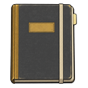 | **RR_CompanyJournal_Closed** | Item | The journal as it sits on a shelf or in a pack: a dark bound cover with a gold band and a page marker. | company field journal | 128 x 128 | one frame | RR_CompanyJournal_Closed.png |
| 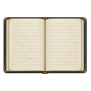 | **RR_CompanyJournal_Open** | Item | The journal open, ruled pages facing up. This is what is drawn while a colonist is actually reading it. | company field journal | 128 x 128 | east, north, south | RR_CompanyJournal_Open_south.png |
| 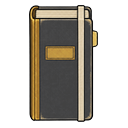 | **RR_CompanyJournal_Vertical** | Item | The journal stood upright, as it appears on a shelf. Seen from the east it is the spine alone, which is correct. | company field journal | 128 x 128 | east, north, south | RR_CompanyJournal_Vertical_south.png |
| — | **RR_ContractPaid** | Sound cue | A short receipt-feed mechanism and stamped latch, without a jackpot melody. | RR_ContractPaid | 1.0 s, 48 kHz mono | — | RR_ContractPaid.wav |
| — | **RR_CutoffThrown** | Sound cue | A heavy switch clack and circuit latch. | RR_CutoffThrown | 0.5 s, 48 kHz mono | — | RR_CutoffThrown.wav |
| 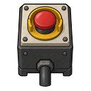 | **RR_EmergencyCutoff** | Building | A sealed box with a palm-sized red stop button and a stub of conduit. Reads the same from every side, which is why one drawing honestly produces all four facings. | emergency cutoff | 128 x 128 | east, north, south | RR_EmergencyCutoff.png |
| 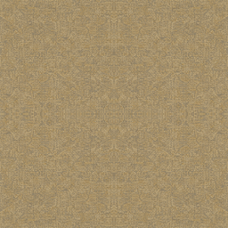 | **RR_FadedInstitutionalCarpet** | Floor | Straw-coloured wall-to-wall weave, worn and dense. Made seamless by mirroring, so no joint appears at a cell boundary. | faded institutional carpet | 256 x 256 | — | RR_FadedInstitutionalCarpet.png |
| 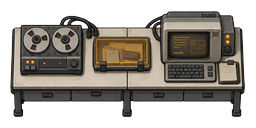 | **RR_FieldAnalysisBench** | Building | A long analysis counter — reel recorder, reader and terminal across one worktop. Three facings, with the end-on view drawn for the rotated footprint. | field analysis bench | 128 x 256 / 256 x 128 | east, north, south | RR_FieldAnalysisBench.png |
| — | **RR_FieldRadio** | Sound cue | A crew member calling in an observation from the field. | RR_FieldRadio | 0.6 s, 48 kHz mono | — | RR_FieldRadio.wav |
| 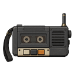 | **RR_FieldRecorder** | Item | A reel-to-reel recorder with a shoulder strap and a short-range set. Stands beside a bench rather than being carried now. | field recorder and radio | 128 x 128 | east, north, south | RR_FieldRecorder.png |
| — | **RR_GateActivate** | Sound cue | A pressure release over a deep settling motor: the connection's payoff. | RR_GateActivate | 2.0 s, 48 kHz mono | — | RR_GateActivate.wav |
| 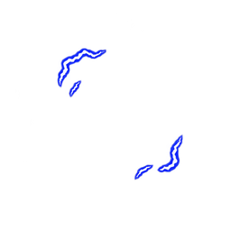 | **RR_GateActivation_01** | Animation frame | Activation phase 1 of 6: small arcs gather at opposing edges. | animation frame, drawn in sequence by code | 256 x 256 | one frame | RR_GateActivation_01.png |
| 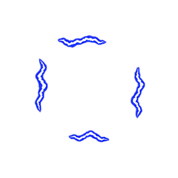 | **RR_GateActivation_02** | Animation frame | Activation phase 2 of 6: four edges gather stronger filaments. | animation frame, drawn in sequence by code | 256 x 256 | one frame | RR_GateActivation_02.png |
| 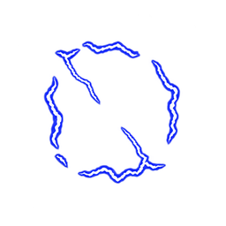 | **RR_GateActivation_03** | Animation frame | Activation phase 3 of 6: peak snap with two thin inward branches, keeping the center transparent. | animation frame, drawn in sequence by code | 256 x 256 | one frame | RR_GateActivation_03.png |
| 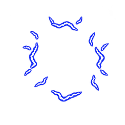 | **RR_GateActivation_04** | Animation frame | Activation phase 4 of 6: scattered residual edge arcs after the peak. | animation frame, drawn in sequence by code | 256 x 256 | one frame | RR_GateActivation_04.png |
| 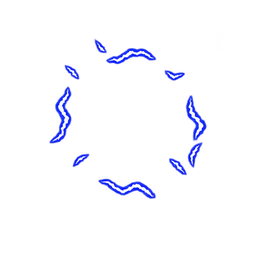 | **RR_GateActivation_05** | Animation frame | Activation phase 5 of 6: remaining edge arcs diminish. | animation frame, drawn in sequence by code | 256 x 256 | one frame | RR_GateActivation_05.png |
| 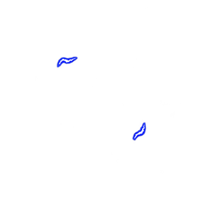 | **RR_GateActivation_06** | Animation frame | Activation phase 6 of 6: two small residual sparks. Stop drawing after this frame. | animation frame, drawn in sequence by code | 256 x 256 | one frame | RR_GateActivation_06.png |
| — | **RR_GateCalibrate** | Sound cue | A short, dry mechanical detent and relay click, subdued enough to repeat at each quarter of a charge cycle. | RR_GateCalibrate | 0.6 s, 48 kHz mono | — | RR_GateCalibrate.wav |
| 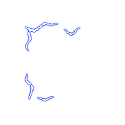 | **RR_GateCharge_01** | Animation frame | Charge phase 1 of 8: sparse blue-white edge filaments, leaving the aperture clear. Shared across all gate footprints. | animation frame, drawn in sequence by code | 256 x 256 | one frame | RR_GateCharge_01.png |
| 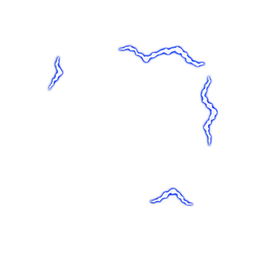 | **RR_GateCharge_02** | Animation frame | Charge phase 2 of 8: discontinuous filaments flicker around the same clear aperture. | animation frame, drawn in sequence by code | 256 x 256 | one frame | RR_GateCharge_02.png |
| 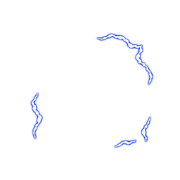 | **RR_GateCharge_03** | Animation frame | Charge phase 3 of 8: blue-edged white filaments with fixed cell registration. | animation frame, drawn in sequence by code | 256 x 256 | one frame | RR_GateCharge_03.png |
| 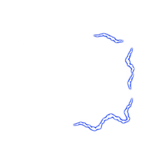 | **RR_GateCharge_04** | Animation frame | Charge phase 4 of 8: edge energy flicker with no solid portal surface. | animation frame, drawn in sequence by code | 256 x 256 | one frame | RR_GateCharge_04.png |
| 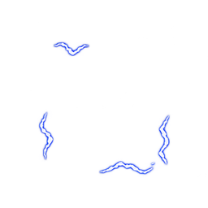 | **RR_GateCharge_05** | Animation frame | Charge phase 5 of 8: sparse edge arcs continue the repeating cycle. | animation frame, drawn in sequence by code | 256 x 256 | one frame | RR_GateCharge_05.png |
| 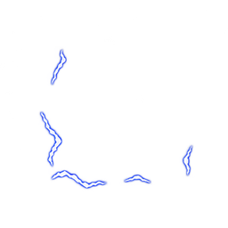 | **RR_GateCharge_06** | Animation frame | Charge phase 6 of 8: short blue-white arcs shift around the aperture. | animation frame, drawn in sequence by code | 256 x 256 | one frame | RR_GateCharge_06.png |
| 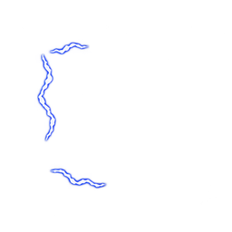 | **RR_GateCharge_07** | Animation frame | Charge phase 7 of 8: edge filaments retain the same registration and scale. | animation frame, drawn in sequence by code | 256 x 256 | one frame | RR_GateCharge_07.png |
| 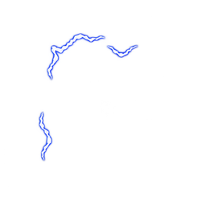 | **RR_GateCharge_08** | Animation frame | Charge phase 8 of 8: the final flicker phase before returning to phase 1. | animation frame, drawn in sequence by code | 256 x 256 | one frame | RR_GateCharge_08.png |
| 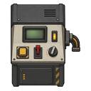 | **RR_GateConsole** | Building | The company's own control console: a slab panel with a green readout, labelled switches and a cable loop. Three facings. | company gate console | 128 x 128 | east, north, south | RR_GateConsole.png |
| — | **RR_GateEmergency** | Sound cue | An uneven failing motor with separated mechanical impacts, distinct from the current warning cue. | RR_GateEmergency | 2.0 s, 48 kHz mono | — | RR_GateEmergency.wav |
| 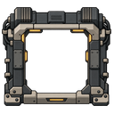 | **RR_GateFrame_1x1** | Gate frame | A hollow machine frame for a single-cell gate: braced corners, cable runs and amber indicator strips. The centre is transparent so the door, its leaves and anyone standing in it stay visible. | cosmetic frame on designated native doors | 128 x 128 | east, north, south | RR_GateFrame_1x1_south.png |
| 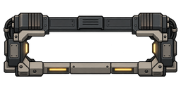 | **RR_GateFrame_1x2** | Gate frame | The same frame built for a two-cell opening, taller than it is wide when the run faces east. | cosmetic frame on designated native doors | 128 x 256 / 256 x 128 | east, north, south | RR_GateFrame_1x2_south.png |
| 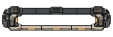 | **RR_GateFrame_1x3** | Gate frame | A long three-cell frame. The run reads as one assembled structure rather than three clamps in a row. | cosmetic frame on designated native doors | 128 x 384 / 384 x 128 | east, north, south | RR_GateFrame_1x3_south.png |
| 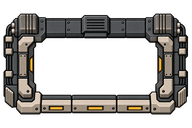 | **RR_GateFrame_2x3** | Gate frame | The widest supported frame, for a bound two-by-three run. Heavier bracing than the narrow ones, because it is holding more open. | cosmetic frame on designated native doors | 256 x 384 / 384 x 256 | east, north, south | RR_GateFrame_2x3_south.png |
| 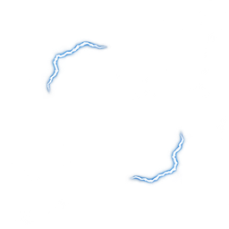 | **RR_GateOpen_01** | Animation frame | Live phase 1 of 8: steady edge filaments around an open aperture, quieter than the charge cycle. Loops while a connection is open. | animation frame, drawn in sequence by code | 256 x 256 | one frame | RR_GateOpen_01.png |
| 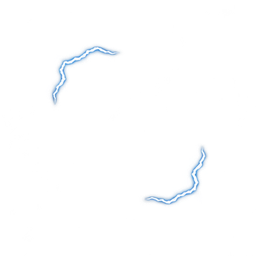 | **RR_GateOpen_02** | Animation frame | Live phase 2 of 8: steady edge filaments around an open aperture, quieter than the charge cycle. Loops while a connection is open. | animation frame, drawn in sequence by code | 256 x 256 | one frame | RR_GateOpen_02.png |
| 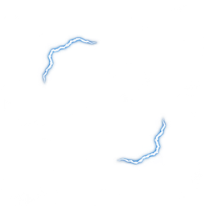 | **RR_GateOpen_03** | Animation frame | Live phase 3 of 8: steady edge filaments around an open aperture, quieter than the charge cycle. Loops while a connection is open. | animation frame, drawn in sequence by code | 256 x 256 | one frame | RR_GateOpen_03.png |
| 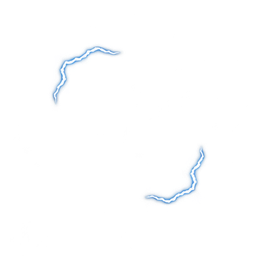 | **RR_GateOpen_04** | Animation frame | Live phase 4 of 8: steady edge filaments around an open aperture, quieter than the charge cycle. Loops while a connection is open. | animation frame, drawn in sequence by code | 256 x 256 | one frame | RR_GateOpen_04.png |
| 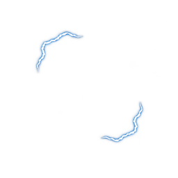 | **RR_GateOpen_05** | Animation frame | Live phase 5 of 8: steady edge filaments around an open aperture, quieter than the charge cycle. Loops while a connection is open. | animation frame, drawn in sequence by code | 256 x 256 | one frame | RR_GateOpen_05.png |
| 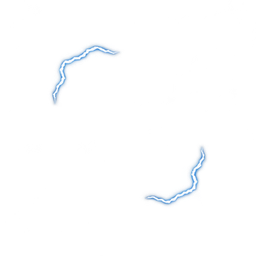 | **RR_GateOpen_06** | Animation frame | Live phase 6 of 8: steady edge filaments around an open aperture, quieter than the charge cycle. Loops while a connection is open. | animation frame, drawn in sequence by code | 256 x 256 | one frame | RR_GateOpen_06.png |
| 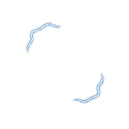 | **RR_GateOpen_07** | Animation frame | Live phase 7 of 8: steady edge filaments around an open aperture, quieter than the charge cycle. Loops while a connection is open. | animation frame, drawn in sequence by code | 256 x 256 | one frame | RR_GateOpen_07.png |
| 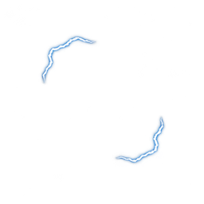 | **RR_GateOpen_08** | Animation frame | Live phase 8 of 8: steady edge filaments around an open aperture, quieter than the charge cycle. Loops while a connection is open. | animation frame, drawn in sequence by code | 256 x 256 | one frame | RR_GateOpen_08.png |
| — | **RR_GateOpenLoop** | Sound cue | A quieter four-second repeating motor presence for an open gate. | RR_GateOpenLoop | 4.0 s, 48 kHz mono | — | RR_GateOpenLoop.wav |
| — | **RR_GatePowerRise** | Sound cue | The gate pulling on its reserve. Low and rising. | RR_GatePowerRise | 2.0 s, 48 kHz mono | — | RR_GatePowerRise.wav |
| — | **RR_GateRampDown** | Sound cue | A descending rev settles into a final latch and silence, giving normal closure a resolved ending. | RR_GateRampDown | 2.5 s, 48 kHz mono | — | RR_GateRampDown.wav |
| — | **RR_GateRampUp** | Sound cue | An industrial motor rev climbs and holds its upper speed. The ending stays unresolved; a brief anti-click fade trims the edge. | RR_GateRampUp | 2.5 s, 48 kHz mono | — | RR_GateRampUp.wav |
| — | **RR_GateSpinLoop** | Sound cue | A repeating low motor hum and periodic pulse for charge-up. Three-second periodic mono loop. | RR_GateSpinLoop | 3.0 s, 48 kHz mono | — | RR_GateSpinLoop.wav |
| — | **RR_GateWarning** | Sound cue | Something is wrong at a gate, or something has come through it. The mod's most-used cue, so it is short and unmistakable. | RR_GateWarning | 1.1 s, 48 kHz mono | — | RR_GateWarning.wav |
| — | **RR_JournalFiled** | Sound cue | Paper friction followed by an archive latch. | RR_JournalFiled | 0.7 s, 48 kHz mono | — | RR_JournalFiled.wav |
| 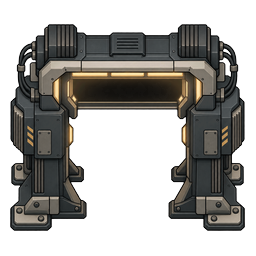 | **RR_MachineGate** | Building | The arch that gives the Set Gate button its picture. Drawn face on, which is right for an interface icon and wrong for the floor, so it is never placed in the world. | button icon; no longer a buildable | 256 x 256 | one frame | RR_MachineGate.png |
| — | **RR_MarkerSet** | Sound cue | A small switch click with a brief indicator tick. | RR_MarkerSet | 0.4 s, 48 kHz mono | — | RR_MarkerSet.wav |
| 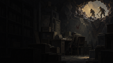 | **RR_Menu_BreachedVault** | Menu background | Two figures at a torn opening high in a wall of collapsed shelving, lit from behind. A way out found in a storeroom that has already failed. | main menu slideshow | 1672 x 941 | — | — |
| 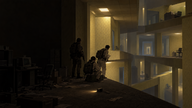 | **RR_Menu_CorridorEncounter** | Menu background | A crew crouched in a lit corridor junction over a casualty, equipment down, one standing watch. Patterned wallpaper and strip lighting. | main menu slideshow | 1672 x 941 | — | — |
| 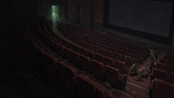 | **RR_Menu_EmptyCinema** | Menu background | Rows of empty red seats in a dark auditorium, one figure slumped at the end of a row and another approaching along the aisle. | main menu slideshow | 1672 x 941 | — | — |
| 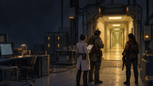 | **RR_Menu_FacilityThreshold_v2** | Menu background | The company side of a gate: instrument racks, a researcher and two armed crew watching a yellow corridor open beyond a machine threshold. | main menu slideshow | 1672 x 941 | — | RR_Menu_FacilityThreshold_v2.png |
| 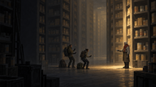 | **RR_Menu_FamiliarStranger** | Menu background | Three figures with torches in a vast warehouse of identical stacked crates, a fourth standing apart in the light, unmoving. | main menu slideshow | 1672 x 941 | — | — |
| 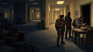 | **RR_Menu_FieldSurvey_v2** | Menu background | A survey team reading at a table in a furnished corridor, lamps on, plants and framed pictures. Ordinary and wrong at once. | main menu slideshow | 1672 x 941 | — | RR_Menu_FieldSurvey_v2.png |
| 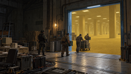 | **RR_Menu_IndustrialGateLogistics** | Menu background | A loading floor with crates on a pallet truck, crew moving them through a wide lit opening into yellow space. | main menu slideshow | 1672 x 941 | — | — |
| 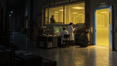 | **RR_Menu_LaboratoryOperations** | Menu background | A lab seen from the dark side of its window: researchers at consoles inside, an open door spilling yellow light. | main menu slideshow | 1672 x 940 | — | — |
| 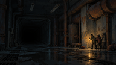 | **RR_Menu_LightsOut** | Menu background | A flooded industrial corridor with failed lighting. A huddle of figures at the right edge is the only thing moving. | main menu slideshow | 1672 x 941 | — | — |
| 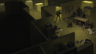 | **RR_Menu_PanicJunction** | Menu background | An overhead view of a yellow cubicle maze, furniture overturned, papers and blood on the carpet, one figure running. | main menu slideshow | 1672 x 941 | — | — |
| 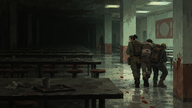 | **RR_Menu_RedTrail** | Menu background | A wet canteen of long tables, a crew carrying somebody out, a hand print and a trail on the wall behind them. | main menu slideshow | 1672 x 941 | — | — |
| 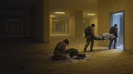 | **RR_Menu_SilentRecovery** | Menu background | A recovery at a lit threshold: one crew member kneeling over a body on the floor, two more carrying a stretcher out through the door. | main menu slideshow | 1672 x 941 | — | — |
| 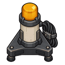 | **RR_ReturnBeacon** | Building | An amber lamp on a weighted tripod with a coiled lead. A marker, not a lamp for lighting a room. | site marker beacon | 128 x 128 | east, north, south | RR_ReturnBeacon.png |
| 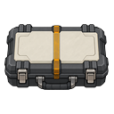 | **RR_SealedEvidenceCase** | Item | A latched transit case with a banded lid and sprung catches. Built to hold findings and nothing else. | sealed evidence case | 128 x 128 | east, north, south | RR_SealedEvidenceCase.png |
| — | **RR_SectionAssembled** | Sound cue | Two fastening strikes followed by a heavier securing latch. | RR_SectionAssembled | 0.8 s, 48 kHz mono | — | RR_SectionAssembled.wav |
| 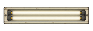 | **RR_SiteFluorescent** | Building | A long institutional strip fitting, seen from above. Flat enough that its east facing is the same drawing turned ninety degrees. | liminal fluorescent fixture | 128 x 384 / 384 x 128 | east, north, south | RR_SiteFluorescent.png |
| — | **RR_SpatialTell** | Sound cue | The space itself behaving incorrectly. Deliberately unlike the other three. | RR_SpatialTell | 1.4 s, 48 kHz mono | — | RR_SpatialTell.wav |
|  | **RR_SurveyTag** | Item | A numbered company tag on a ring, with a printed arrow and a small lamp behind the card. | survey tag | 128 x 128 | east, north, south | RR_SurveyTag.png |
|  | **RR_UtilityGenerator** | Building | A compact wood-fired set with an exhaust stack and a side hopper of split logs. The hopper is why it burns wood rather than chemfuel. | company utility generator | 256 x 256 | east, north, south | RR_UtilityGenerator.png |

## Where a master is a dash

Every drawing of a game object is cut from a larger master kept outside the package, and so is every cue; that master's filename is in the last column.

**10 of the 69 entries have no separate master, and every one of them is a menu background.** There is nothing to cut: a background ships at the size it was drawn.

